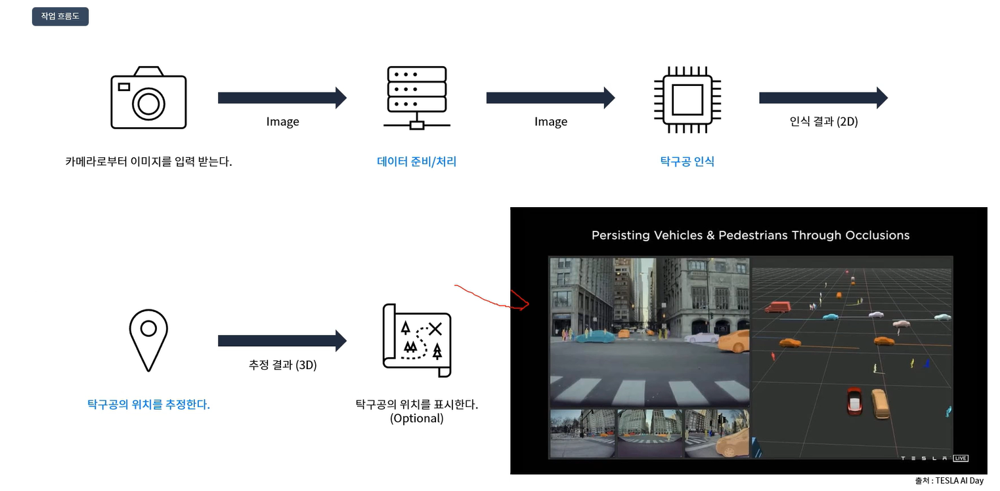
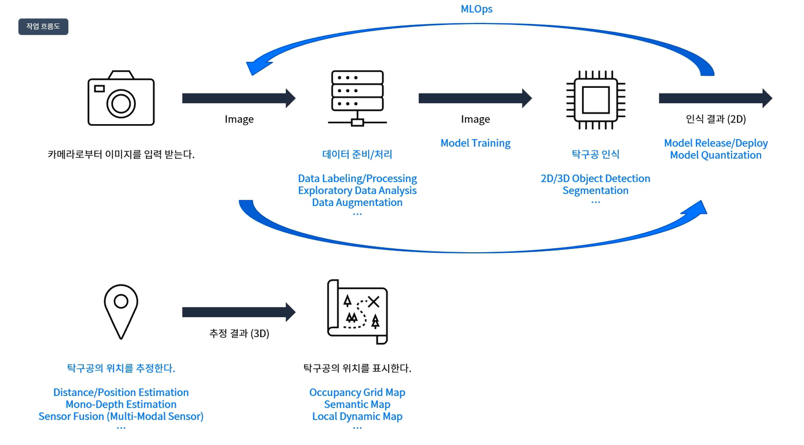

> 프로젝트 소개 강의 필기

# 프로젝트 개요
1. RGB 카메라로부터 입력된 이미지에 존재하는 탁구공을 검출한다. : 데이터 수집 및 처리, 증강 및 학습, 추론 수행
2. 탁구공의 실제 위치를 추정한다. : 카메라 캘리브레이션, 센서퓨전, 위치 추정
3. (option) 2D 지도에 탁구공의 위치를 표시한다.

# 프로젝트 파이프라인

딥러닝 모델에 입력하는 데이터 이미지는 왜곡이 없는 것이 좋음. 또는 바운딩박스 4개의 포인트를 undistort하는 방법도 있음. 하지만 디버깅 등의 문제 때문에 전자의 방법을 추천하며, 카메라로부터 이미지를 입력받을 때부터 왜곡이 없으려면 결국 데이터 수집할 카메라부터 intrinsic 캘리브레이션을 해놓아야 함

# 프로젝트 가이드
## 1) data collection
* 자이카에 장착된 카메라를 사용해 탁구공 이미지(비디오)를 촬영한다.
* 비디오라면 연속된 이미지를 적절한 시간 간격으로 이미지를 추출한다
* 데이터 라벨링을 위해 별도 디렉토리에 저장한다
## 2) data labeling
* 적절한 레이블링 툴을 선택한다: CVAT, LabelImg 등
* 수집된 데이터에 대해 레이블링 실행
* 레이블링 데이터의 형식 확인
## 3) model training
* 적절한 객체 탐지 모델을 선택
* 선택한 모델의 학습 데이터 형식 확인
* 레이블링 데이터를 모델 학습 데이터 형식에 맞게 변환
* 모델 학습 수행
* 모델 학습의 튜닝 포인트를 조절하며 학습 실험 : 학습 하이퍼파라미터 조정, 더 많은 학습 데이터 혹은 데이터 증강
* 학습 결과 보며 잘 진행되는지 확인
## 4) model inference
*  학습 그래프 추이 확인하며 적절한 모델 파일 선택
* 비디오 데이터를 입력으로 하는 model inference 코드 작성. 고성능 컴퓨터에서 결과 확인
* 실제 자이카 환경에서 동작 가능한 모델 추론 코드 작성
    * model inference FPS(한 장의 이미지 처리에 걸리는 시간) 확인: 작은 규모의 모델을 선택하거나, pruning을 하거나, GPU 하드웨어 가속화(tensorrt 등). 15fps이면 너무 좋고 8fps도 나쁘지 않음!
    * model prediction accuracy(실제 환경에서 검출이 잘 되는지) 확인: F1 score, MAP 등
## 5) object position estimation
* 탁구공의 실제 지름 측정
* 모델의 예측 결과(bbox 위치와 크기, 클래스) 중 활용 가능한 정보 선택
* 자신만의 객체 위치 추정 알고리즘 작성. 실제 자이카에서 실험 결과를 비교하고 분석. 객체의 거리 정확도(종/횡방향 정확도) 측정

# 프로젝트 결론
* 모델 학습이 충분히 진행되었나? 만약 모델 학습 과정에서 개선이 필요하다면 어떤 방법이 있나?
    * fine-tunning for hyper-parameter
    * more training dataset
    * another object detection model
    > 실제 자율주행 인지 기술은 변화하는 환경 내에서 일관된 성능 확보가 중요함. 어떤 방법이 있나?
* 모델 학습을 하는 고성능 컴퓨터에서는 빠르게 동작하던 모델이 자이카에서는 어찌 나오나?
    * model quantization
    * model acceleration
    > 자율주행과 같은 환경은 모델의 검출 성능도 중요하고 빠른 속도도 중요함. 속도 향상을 위한 방법은 무엇이 있을까?
* 장애물(탁구공)의 위치를 최대한 정확히 추정할 수 있나? 시간에 따라 장애물의 위치를 추정한다면 장애물의 속도와 가속도는 추정할 수 있나? 5초 뒤 예상 위치는?
    * vision geometry
    * LiDAR, RADAR
    * Sensor Fusion
    > 자율주행에서 인지의 역할은 장애물을 인식하는 것 뿐만 아니라 장애물을 포함한 주행 환경에 대한 종합적 정보를 다뤄야 함. 주행 환경 데이터를 만드는데 필요한 정보는 무엇이 있나?

# Future Study Map

