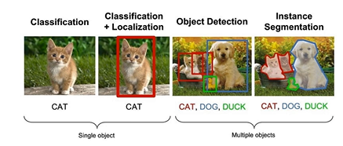
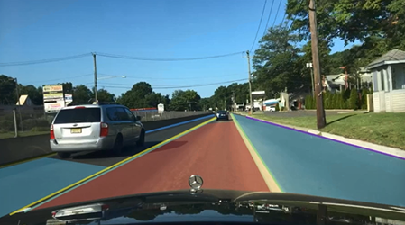
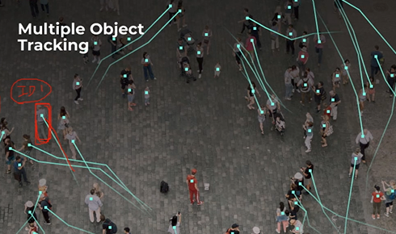
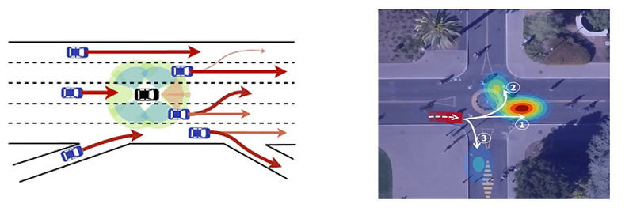
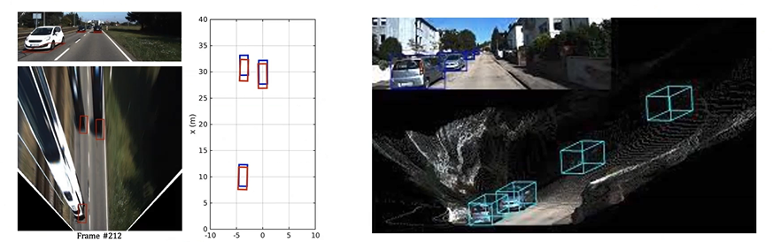
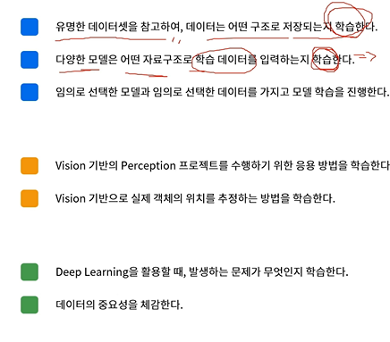
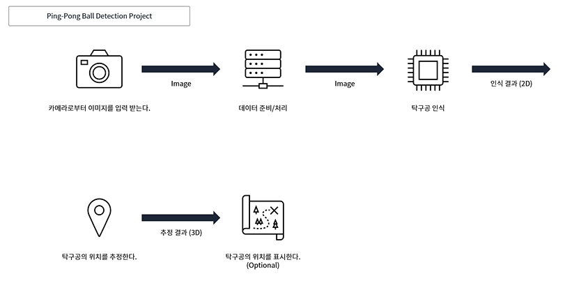

> Lec1 강의 필기하기!

# Perception 기술 분류
## Perception 기술 분류
* 센서: 비전(카메라), 라이다, 레이더 등
* 기술: detection, segmentation, tracking, prediction, 3d pose estimation, sensor fusion, acceleration 등

## detection
* 비전, 라이다, 레이더 등 센서 활용해 주변 환경에 존재하는 특정 객체를 검출
* 비전 기반의 2d 객체 검출, 라이다나 레이더를 활용한 3d 포인트 클라우드 객체 검출, 최근에는 비전으로 2d도 함

## segmentation
* 객체 형태 분할. 바운딩박스와 출력 다름(배경 빼고 객체만)
* 비전, 포인트 클라우드 등 다양한 센서 활용
* instance segmentation(각 객체를 다른 것으로. 철수, 영희, 민철이...) <=> semantic segmentation(같은 사람이라고 인식)
* 검출과 분할의 차이 : 
* 예: 운전 가능 영역 

## tracking
* 검출한 객체에 고유한 id 부여해 동일한 객체임을 추적
* mulitple object tracking(MOT, 다중 객체 추적), single OT(SOT, 단일 객체 추적)
* 카메라는 프레임 속도가 있기 때문에 속도(vector)를 알 수 있고, 이후 위치를 예측할 수 있음을 이용할 수 있음

## prediction
* tracking과 유사한 부분도 있음
* 다양한 센서 사용해 융합할 수 있음. 트래킹은 각각의 센서에 각각의 tracker가 붙어야 함
* 객체의 현재 움직임과 객체의 고유한 특징(non-holonomic...) 등 다양한 정보를 바탕으로 미래 움직임 추정
* sementic 정보도 이용함
* multimodal trajectory prediction이라는 연구도 활발함

## 3d pose estimation
* 객체 인식뿐만 아니랴 객체의 정확한 위치 추정 기술이 중요. 프레임 내가 아니라 실제 위치.
* 비전의 geometry 정보 사용 or 위치 정보를 획득하는 다른 센서와 융합
* multiple view geometry(= 3d vision) 분야의 기술 활용
* 라이다, 레이더처럼 바로 geometry 얻을 수 있는 경우도 있음. 라이다 입력 데이터는 특정 포인트의 3차원 위치 정보임

## camera vs LiDAR
* 라이다: 객체 구분할 수 없음. 위치 정보 획득 가능
* 카메라: 그 반대

## sensor fusion
* Camera & Lidar calibration이라고도 함
* 각 센서가 장단점ㅇ르 가지고 있으므로, 유의미한 정보 획득 위해 사용함
* 예: 라이다 데이터를 카메라 프레임에 옮김. 관심 있는 게 자동차라고 하면 자동차의 x, y, z 좌표 얻는다던지

## acceleration
* 인식의 많은 알고리즘이 딥러닝 기반으로 변화하며 컴퓨팅 파워가 중요해짐
* 자동차는 빠른 속도로 움직이므로 검출 성능, 검출 속도도 중요
* 최적화 방법 다양: model quantization(모델 양자화), pruning, hardware optimization 등

# 강의에서 다룰 내용(perception & deep learning 기초)
* 간단 내용
    * 실제 perception 프로젝트의 파이프라인 요소 학습하기
    * detection을 활용한 perception 프로젝트
* 원하는 객체 인식 모델 선택, 원하는 데이터셋 선택, 원하는 결과 나오도록 해야 함
* 실제 서비스에 딥러닝이 적용되려 해결할 문제
    * 인식해야 하는 대상에 대한 데이터 준비 방법
    * 인식하는 환경/대상이 변화하는 경우 대응하는 방법

