# 오늘 배울 내용
* Perception Dataset
* 공개 데이터셋, 데이터셋 만드는 법
# Introduction
* MLOps의 흐름 : 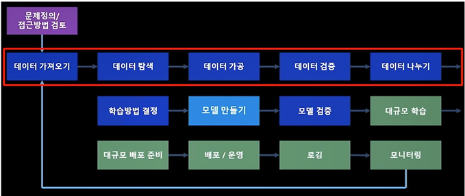
    * 데이터 탐색: EDA
    * 데이터 가공: 전처리

- - -

# KITTI 데이터셋
## intro
* 자율주행을 위한 데이터셋은 아님
* 2012년 공개해 그 당시에는 구성하기 힘든 센서(다채널 라이다 등)으로 이루어져 있음
* 홈페이지에서 다양한 데이터를 볼 수 있으며, setup 메뉴에서 취득 차량 정보 볼 수 있음

## setup
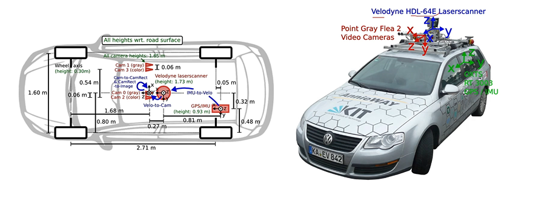
* 카메라 외 다른 센서를 추가로 사용한다면 각 센서의 위치와 좌표계 확인 필

## object detection
2d 객체 검출, 3d 객체 검출(라이다 정보 사용), BEV 시점에서 데이터 제공

## 2d 객체 검출
* 'training labels of object data set'에서 레이블링 데이터 얻을 수 있음. 
* 'object development kit'에서 2d 객체 검출과 관련 정보 있음. 여기서 readme.txt에서 레이블링 포맷 확인 가능
* training labels of object data set 파일에서 레이블링 파일 있음

## YOLO로 실습(bbox on image)
* https://github.com/ultralytics/yolov3 : 파이토치로 작성됨
* train custom data 문서 참고
* dataset.yaml 파일을 우리 걸로 수정
    * nc(number of classes), class names 등 수정
    * 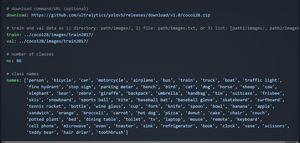
* bbox
    * 
    * 한 장의 한 박스에 대한 포맷: `class ID    x   y   width   height`
* 이미지와 레이블링 파일은 같은 이름(000.jpg, 000.txt)이어야 함
* 이미지, 레이블링 파일 디렉터리 구조 주의
* 이미지 위에 바운딩 박스 그리기
    * 구현할 함수
        * 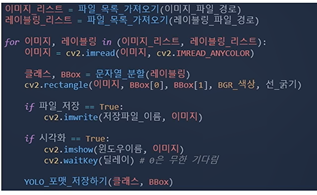
        * (1) 파일 목록 가져오기(python glob나 os 패키지 활용)
        * (2) 문자열 분할해 클래스와 바운딩박스 구분. 레이블링 데이터 포맷 참고
        * (3) yolo 포맷으로 저장
    * 샘플 데이터로 학습 데이터(이미지, 레이블링 파일) 만들고 학습 해보기

- - -

# BDD100K 데이터셋
## infro
* 2017년 공개된 자율주행을 위한 딥러닝 어플리케이션 데이터셋
* 데이터 소개: https://www.bdd100k.com/
* 데이터 다운: https://bdd-data.berkeley.edu/index.html
* 다양한 도시, 환경(날씨, 시간) 등에 대한 데이터로, 현실성 있음
* object detection, segmentation, lane marking 등 다양한 데이터 존재
* 실습: 100K images, detection 2020 labels 사용할 것
* [data doc 페이지](https://doc.bdd100k.com/download.html)에서 데이터 소개 확인 가능

## JSON
* JavaScript Object Notation의 약어로, 자바스크립트 언어의 자료형을 텍스트로 표현한 포맷
* 데이터 주고 받을 때 정해진 형식이 있으면 쓰고 읽기가 편하여 자주 이용됨

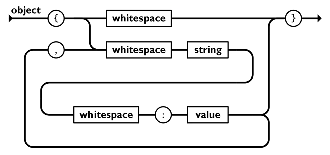

* 문법
    * `{}`기준으로 블록 분할
    * "이름" : 값(숫자) 또는 "값(문자)"
    * `[]`은 배열(리스트) 의미 (ex. 한 이미지 내에 여러 개의 객체가 존재할 때)

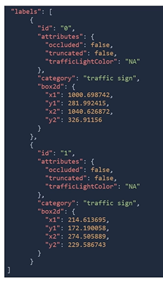

## BDD100K labeling format
* labels 파일을 파싱해서 name으로 이미지 읽기를, box2d로 바운딩박스 정보 얻음, 카테고리로 클래스 파악 가능
* python으로 json 파일 파싱하는 방법 알아야 함(c++에서는 rapidjson을 이용)
* json 파일 예시
    ```
    "name": 파일명,
    ...
    "labels": bbox 정보
    [
        {
            "id": 객체 아이디,
            "attribute": 객체 속성,
            "category": 카테고리,
            "box2d": bbox 좌표
            {
                "x1":...,
                "y1":...,
                "x2":...,
                "y2":...,
            },
            {
                ...
            }
        }
    ]
    ```
* 파이썬 파싱 코드 예
    * `{}`은 딕셔너리 객체로, `[]`리스트 객체로 반환
```py
import json # json패키지

with open("sample.json", "r", encoding="UTF-8") as json_file:
    sample = json.load(json_file)

print(sample, type(sample))
print(sample['name'], type(sample['name']))
print(sample['class'], type(sample['class']), len(sample["class"]))
```
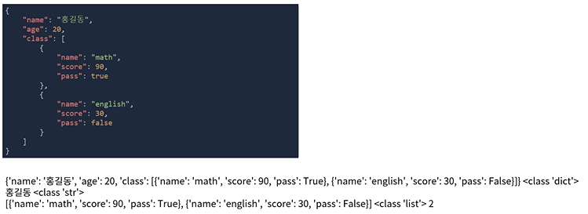

## 실습
BDD100K 데이터로 학습 데이터 생성 & YOLOv3 모델 학습

- - -

# Cityscape 데이터셋
## intro
* detection보다는 segmentation을 위한 데이터셋. KITTI, BDD는 detection위주
* 다양한 도시의 semantic segmentation 데이터
* https://www.cityscapes-dataset.com/

## segmentation
객체의 형태를 다각형으로 표현 -> bbox는 3개의 포인트가 필요하나, seg에서는 N개의 포인트 사용

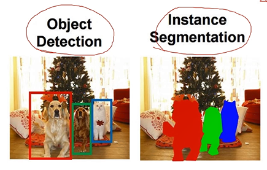

## 파일 구조
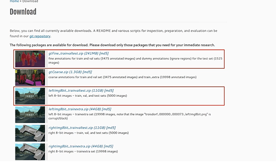

파일 구조는 아래와 같다. 폴더 이름은 각 도시임. 
* gtFine은 레이블 정보로, 한 이미지 당 4개씩 데이터가 존재. 
    * json 파일이 polygon위한 정보. 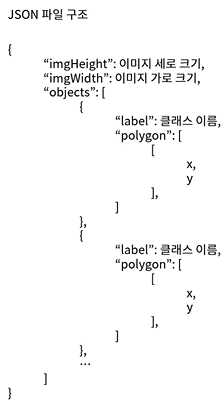
    * color.png 로 끝나는 파일은 객체를 고유한 색상으로 표현한 이미지. 
    * instanceIds.png 파일은 각 객체를 개별적 아이디로 구분 for instance segmentation
    * labelIds.png는 각 객체를 동일한 클래스로 구분. for semantic seg
* leftImg8bit 폴더는 원본 데이터.

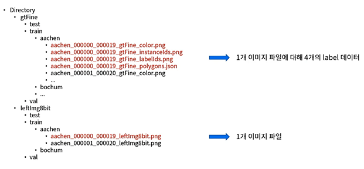

## 실습
* Cityscape 데이터 전처리, 간단한 모델 학습
* 1) 이미지 기준으로 Labels 데이터 가져오기(KITTI 코드 재사용 가능)
* 2) Ploygons 파일 데이터로 Training 데이터 만들기(color, instanceIds, labelIds가 그 결과)
* 활용 모델: https://github.com/chenjun2hao/DDRNet.pytorch

- - -

# 데이터셋 찾는 방법: scale
* 실제 풀어야 하는 문제에 대한 완벽한 공개 데이터셋은 없음. 따라서 자신만의 데이터 구축해야 함 -> 시간 비용 많이 듦. 최대한 공개 데이터셋 활용하는 게 좋음
* 데이터셋 구축에는 비용도 많이 들고 유지보수(클래스 수정, 추가 등)는 더 힘들기 때문에 공개 데이터셋 보고 어떤 규격과 정책으로 데이터 만드는지 '데이터에 대한 지식'을 확보하는 게 중요
* Scale: 자율주행 관련 다양한 데이터를 전체적으로 확인할 수 있음 (https://scale.com/open-datasets)

# 딥러닝 모델 찾는 방법: papers with code
* 코드와 함꼐 공개한 논문들 모아놓은 사이트
* SOTA 모델

- - -

# 실습: BDD100K를 YOLOv3에
