# Data Labeling의 소개
확보한 raw 데이터(원시 데이터)(IMU, LiDAR 등 센싱 데이터)를 유의히만 작업에 사용하도록 데이터를 만드는 작업. 레이블링, annotation, tagging으로 부르기도 한다. 기계학습이나 딥러닝 등에 인공지능 학습에 필요한 데이터를 만든다.

raw data -[labeling, annotation]-> labeled data -[storage]-> dataset

컴퓨터 비전에서는 이미지에 필요한 작업(분류, 탐지 등)에 대한 결과(target)를 미리 입력하는 작업이다. 분류에서는 이미지 클래스의 정보를, 탐지에서는 바운딩박스와 클래스 정보인 셈이다. 레이블링 툴을 최소 한 가지 이상을 다루는 것이 중요하다.

이렇게 만들어진 데이터는 모델의 최대 검출이나 분류의 성능이 될 수도 있고, 또다른 데이터를 만드는 재료가 될 수도 있다. 데이터가 잘못되면 잘못된 모델을 택하는 것보다 결과에 더 큰 영향을 미친다.

데이터를 만드는 작업은 단순하고 반복적이라 기피하는 작업이나 매우 중요한 작업이다. 데이터와 관련된 작업이 머신러닝, 딥러닝의 대부분을 차지한다.

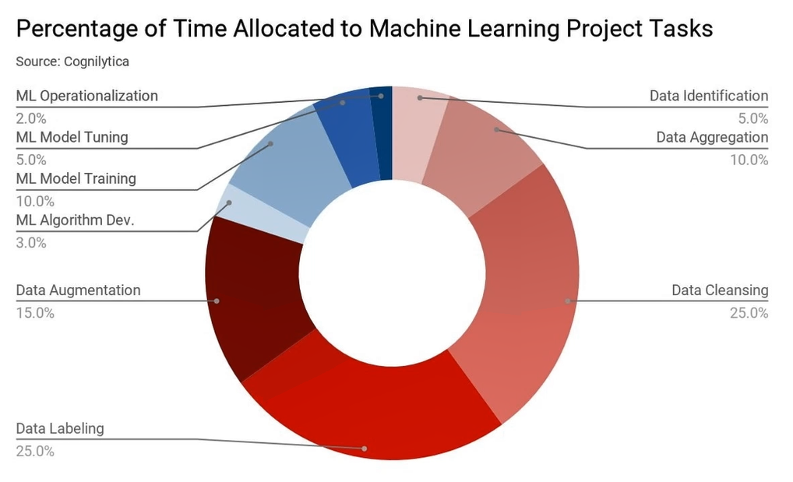

현실에서는 3가지 이유로 학습 데이터를 직접 만들어야 한다. 

1. 각 회사마다 풀어야 하는 문제가 다르다. 공개된 데이터셋에 없는 객체, 세부적인 객체가 필요한 등
2. 주어진 환경과 조건이 다르다. 공개된 데이터셋과 다른 환경일 수 있다.
3. 환경은 늘 변화한다. 시간, 날씨, 대상이 변하는 경우, 취득 환경과 적용 환경이 다른 등...

데이터가 많을 수록 모델의 성능은 대체적으로 올라간다.

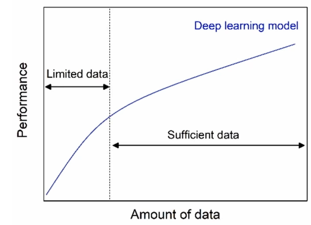

그러나 데이터를 다루는 작업을 위임(협업)한다면, 데이터 구축 프로세스를 만들어야 한다. 그들은 데이터에 대한 도메인 지식도 낮고 툴 사용도 미숙할 수 있다. 따라서 위임을 위해서는 이 프로세스를 경험해봐야 한다.

# Data Labeling
데이터 레이블링 툴 중 공개 툴에는 CVAT, labelme, labelmg 등이 있다

## CVAT 설치
도커 이미지를 제공해 편리한 설치가 가능하다.

> 도커를 사용하면 환경 구축이 간단하다. 개발 시 서로 사용하는 버전이 다를 때 등에 대처하기 쉽다.

강사님은 WSL2를 통해 리눅스 환경을 구축해 사용한다.

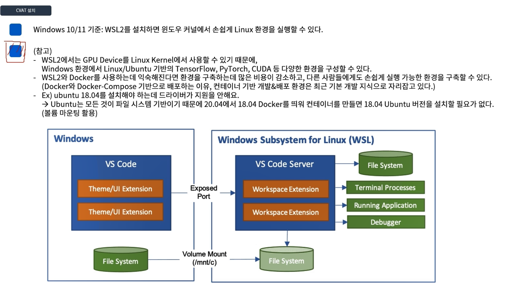

* WSL 설치 : https://docs.microsoft.com/en-us/windows/wsl/install
    * WSL에서 20.04인지 18.04인지 선택 가능
    * username=eungi, pw=qwer1234로 설치
* 도커 설치: Docker desktop(윈도우, 맥에서 GUI 제공 / 리눅스는 CLI)
    * https://www.docker.com/products/docker-desktop/
    * 윈도우에 WSL을 올리고 그 위에 도커를 올리면 도커를 리눅스 환경을 쓸 수 있다.
    * cvat 설치해서 실행해보면 이렇게 나옴 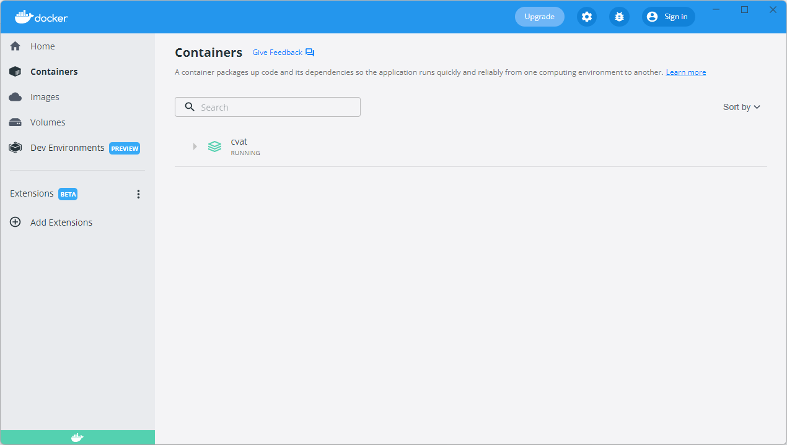
* Docker-compose와 CVAT 레포지토리를 받아 설치함
    * 설치 관련 읽을 거리: https://openvinotoolkit.github.io/cvat/docs/administration/basics/installation/)
    * CVAT_HOST 환경변수 : 외부에서 CVAT 접속이 필요할 때 프로그램을 실행하려는 컴퓨터의 IP 주소를 입력(ipconfig(Windows), ifconfig(Ubuntu))
    * `git clone https://github.com/opencv/cvat`
    * `cd cvat`
    * `docker-compose up -d` : 도커를 이용하기 위해 컴포즈를 설치(?). 이미지 다운받아 컨테이너 만들기 위해 실행. d는 daemon(백그라운드 프로세스로 사용하겠단 맥락. 터미널 꺼도 중단되지 않게)
* 우분투에 설치하다면
    * 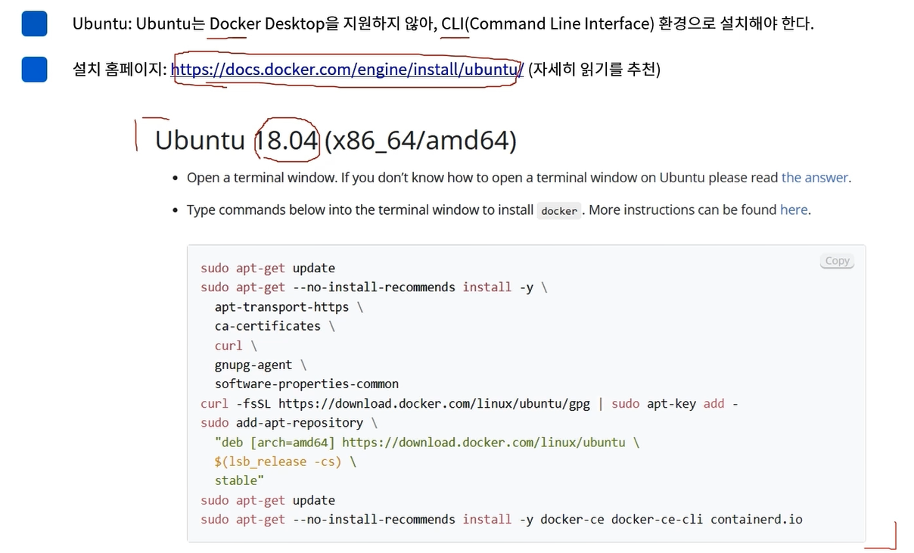
    * 
    * 권한 에러 발생하면 루트 권한으로 쓰기 보다는 유저 그룹에 지금 사용자를 추가하는 것이 안전
    * 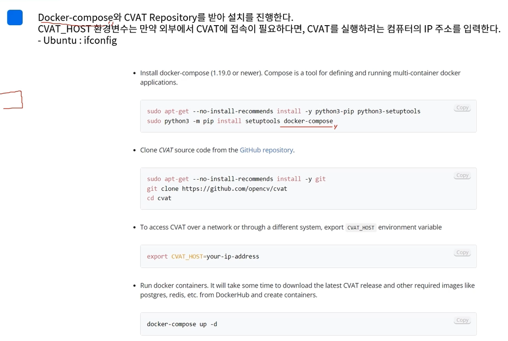

## CVAT 사용
* (CVAT_HOST 미설정 시) 인터넷 브라우저에 주소 입력(`http://localhost:8080/auth/login` 혹은 `http://IP주소:8080/auth/login`). 계정 만들기
* tasks/project 단위로 라벨링 할 수 있다.
* 3단계의 작업이 가능한데, Project>tasks>job(task를 나눔. 이미지를 몇 개씩 나눈다던지)이다. 
* Task를 만들어보자. 옵션으로는 labels(원하는 크래스를 원하는 색상으로 추가), select files(이미지업로드해 라벨링 작업), advanced configuration(이미지 압축 등 세부 설정) -> 만들면 task 목록에서 확인 가능
* task는 여러 job을 가지며, job은 task 생성 시 설정한 이미지 개수로 생성됨.
* 레이블링을 한 뒤에, Menu - Export task dataset에서 다양한 데이터 포맷으로 변환이 가능함. KITTI, CityScape, YOLO 등등

# data augmentation
## introduction
데이터가 많을수록 좋다지만, 환경이 변화할 때마다 새로운 데이터를 데이터 라벨링만으로 해결할 수 없다. 라벨링을 최소화하며 효과적 데이터 증강 방법들이 제안되고 있다.

> 참고 논문: A survery on Image Data Augmentation for Deep Learning

데이터 증강의 기본은, 데이터가 가진 고유한 특징이나 특성에 추가, 변경, 제거 등으로 새로운 이미지를 만드는 것이다.

## data augmentation
### 색공간 변형
image color space를 변형 예: 수평 뒤집기, 자르기, median 블러, 대비, hue/saturation/value, 감마 등 조정

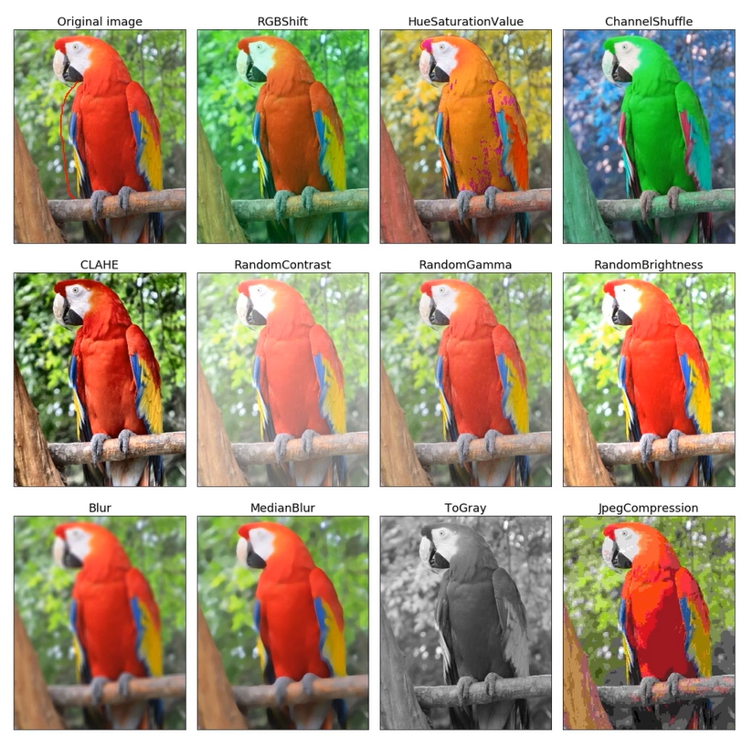

* RGB Shift: 각 색공간 값을 변경시킴. 어떤 채널을 얼마나 변경할지는 확률로 결정
* hue/saturation/value: HSV 색공간에서 위와 동일한 식으로 조정
* ChannelShuffle: R, G, B를 서로 변경
* CLAHE: 대비값에 히스토그램 equalizer를 적용
* ToGray: 모델의 입력 채널 고려해 3채널로 다시 바꿀지, 1채널로 둘지 결정

### 이미지 변형(기하학적 형태)
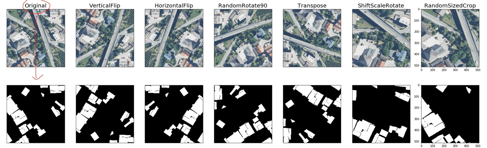
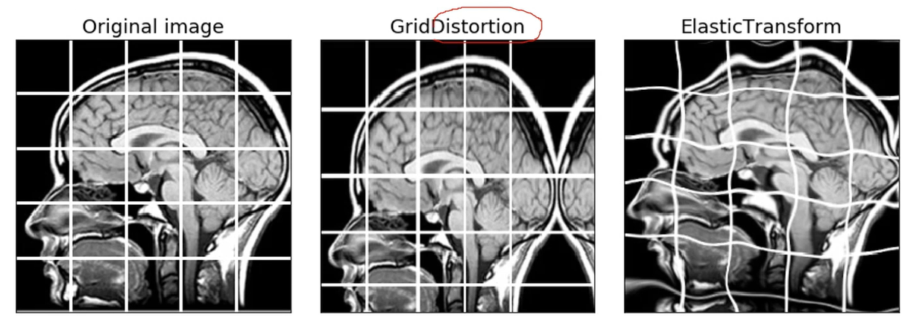

뿐만 아니라 노이즈, 가림(masking) 등도 있다.

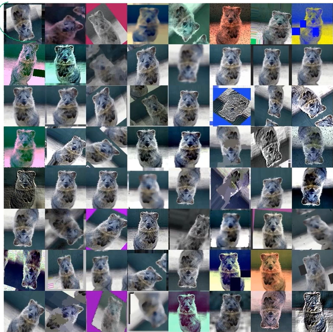

### detection과 segmentation에서
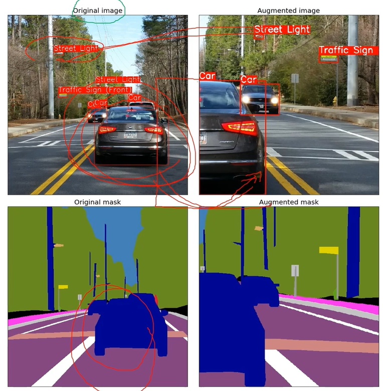

변경된 이미지에 맞게 박스 크기 등이 조정됨( 파이썬 패키지 이용 )

원본 이미지를 증강해 모두 메모리에 저장하면 매우 메모리 공간을 많이 차지함. 따라서 학습 시에는 dataLoader로 원본을 불러오고 train으로 들어가기 전에 aug를 적용하는 경우가 있음. 1에폭 당 N장이라고 하면 단 이럴 때에는 한 에폭에 N장임은 동일. N 장을 6배로 증강해 저장한 후 전부 입력 데이터로 들어가면 6N장을 학습. 이 차이를 구별하자. 전자의 경우에는 에폭을 늘려줘야 입력 데이터 수가 늘어나는 효과를 볼 수 있을 것.

## 주의점
추가적 데이터 제작 없이 모델 성능을 확보할 수는 있으나, 주의가 필요하다. 일례로, 색상정보를 활용해야 하는데 색공간을 변형하면 안된다. 보유한 데이터오 ㅏ모델의 목적을 고려해 적절한 방식을 선택해얗 ㅏㄴ다.

데이터 증강 라이브러리의 예는 아래와 같다.
* imgaug
* Albumentations: https://albumentations.ai/ (파이토치와 잘 맞음, 조금 더 전문적)

- - -

# 실습1

* 프로젝트 만들고 라벨 지정한 뒤 task 만듦
* 첫번째로는 obejct_detection task를 만듦
* task 제작 하단의 옵션에서 이미지 크기를 70%되어 있는 것을, 여기선 100으로 함. cvat로 원본을 바로 옮겨놓으면 로딩이 오래 걸릴 수 있어 디폴트 값은 70으로 되어 있는 것. segment size도 2로 변경. job이 두 개가 생길 것임.
* 이미지도 업로드하고 task 제작 완료

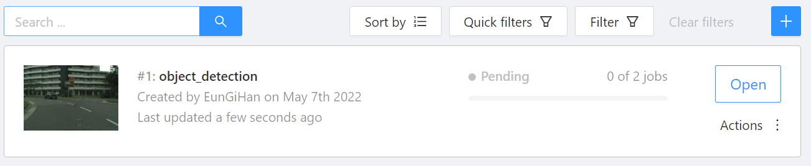
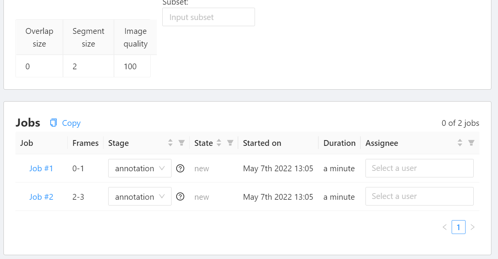

* task를 semantic_segmentation으로도 만들어봄.

* object detection task를 열어 job1을 선택해서 라벨링을 해봄. 왼쪽 바의 사각형 - shape.
* 상자 우클릭하면 라벨 변경 가능
* 오른쪽 탭 하단에서 박스의 투명도 변경 가능

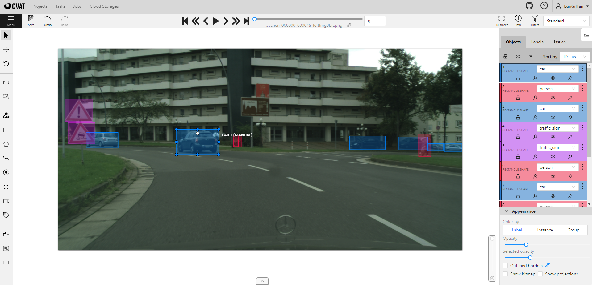

* 저장 후 메뉴 - export - KITTI, save, 파일 이름 지정해 다운로드
* 메뉴 - finish 하면 task에서 completed 표시됨
* segmentation은 사각형이 아니라 다각형으로 표시해 레이블링. alt 누르면 점 없앨 수 있고 shift 누르면 편집 가능
* 편집 시 겹쳐진 다른 다각형이 거슬린다면 우클릭 - 잠금 이나 보지 않음 아이콘 클릭
* cityscape로 내보내기
* 3차원으로 bbox하려면 cuboid 직육면체 아이콘. 원형이려면 ellipse

> shortcut: N - 그리기, Shift-N 끝내기

- - -

# 실습2

툴 설치하고 

제공된 예시 코드 돌려보기

document 보면서 공부하기