# Camera Modeling
## intro
자율주행에서 perception에서는 주행 환경을 인지(인식 + 이해)하는 과정으로, 유의미한 정보를 생성하는 단계가 필요하다. 비전에서는 이미지 영역에서 네모 박스를 찾는 게 중요한 게 아니라, 객체를 인식한 뒤 차량과 객체의 관계를 파악하는 것이 중요하다. 즉, 3차원 위치 정보를 알아내야 한다('3D POSE'(Position, Object / estimation))

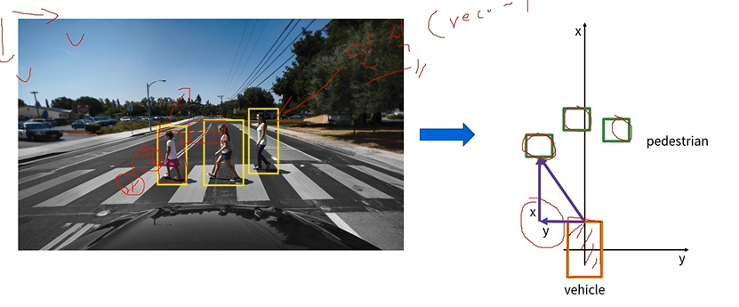

이번 강의에서는 3D POSE estimation의 기본적인 비전 기반 기술을 배운다. vision geometry의 기본적 지식을 배운다.

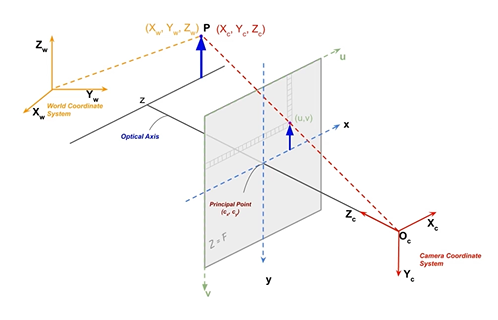

위 그림은 카메라 투영에 대한 기하학적 정의이다. 3차원 공간에 대한 객체의 위치를 찾는다. 3차원 공간을 2차원에 투영한 게 사진이고, 이를 기반으로 다시 3차원의 위치를 추정한다.

## 카메라 모델
### 카메라
카메라는 3차원 공간인 세상(world)에 존재하는 대상(object)를 2차원 공간인 이미지 평면(image plane)에 투영(projection)하는 센서이다.

카메라 모델: 카메라의 투영 과정을 수학적 모델로 표현한 것.

사람의 경우, 눈 두 개와 머리 하나를 가지고 있음은 카메라 2대와 컴퓨터 1대를 가진 것과 같다. 어느 지점이 가깝고 먼지, 이미지에서 표현되는 크기는 달라도 실제 크기는 같음을 인지할 수 있다. 반면 이미지는 이런 공간감을 바로 캐치할 수는 없다.

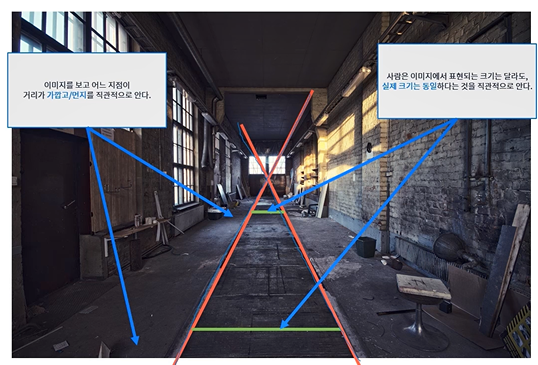

> 스테레오 카메라(stereo camera): 2대의 카메라를 사용하는 것

> 소실점(vanish point)과 소실선(vanish line)

### 카메라 모델
사람의 눈에 물체(예: 사과)가 보이는 건, 빛이 사과에 반사되어 눈으로 들어오기 때문이다. 실제론 빛은 수많은 곳에서 출발하고, 사과는 빛을 난반사한다.

카메라는 3차원 공간에 존재하는 물체에 반산된 빛을 기록하는 장치다. 미세한 위치에 무한에 가까운 난반사 빛을 카메라에 입력하면 사과가 아닌 이상한 이미지가 만들어진다.(빨간 색만 가득한 이미지라던가) 눈으로 보거나 카메라로 찍었을 땐 딱 사과 그림만 출력되는데, 이 이유는 핀홀 모델이나 망막의 원리 때문이다.

### Pinhole Camera Model
빛이 들어오는 구멍을 아주 작게 만들어 난반사된 빛이 들어오지 못하도록 막는다.

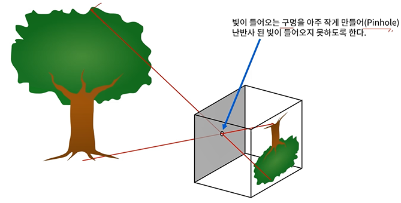

이런 원리로 동일한 크기의 물체라 하더라도, 가까이서 촬영하면 크게 보이고 멀리서 촬영하면 크게 보인다. 반사된 빛과 핀홀의 관계가 달라지기 때문이다. 

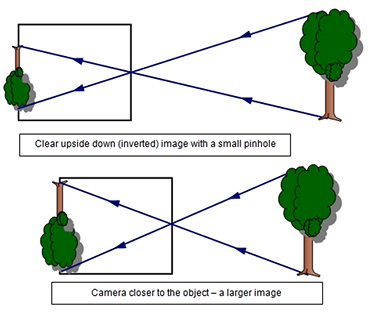

카메라 박스(상과 핀홀 간 거리)의 길이를 f, 카메라로부터 물체까지 거리를 D, 물체의 높이를 H, 상의 높이를 h라 할 때, 그들의 비례식으로 크기를 구할 수 있다.

핀홀 카메라의 geometry & formular는 아래와 같다. 

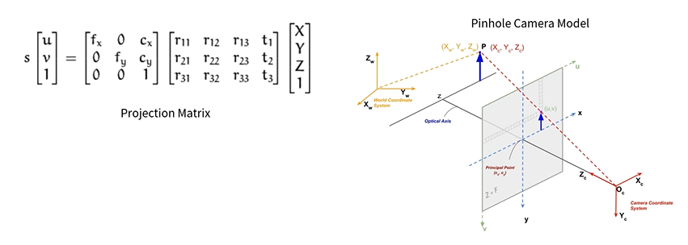

$[u, v, 1]$은 이미지 상에서의 좌표이다. 앞에 붙은 s는 scale factor로 카메라 고유한 값이다. $[X, Y, Z]$는 객체의 실제 위치이다. 투영 행렬에서 맨 앞 행렬은 intrinsic(카메라 자체의 특성), 그 뒤 행렬은 extrinsic(카메라와 대상과의 관계)라고 부른다. r은 rotation(회전)의 약어 t는 translation(평행이동)의 약어이다. 이는 곧 기준 좌표계로부터의 변환을 의미한다. scale factor인 s는 모르는 값이며, 우변의 계산을 통해 계산해야 하는 값이므로, intrinsic & extrinsic을 inverse해서 좌변에 곱해줌으로써 물체의 좌표를 추정하면 된다는 접근은 불가능

### 그 외 카메라 모델
* Fisheye Camera model
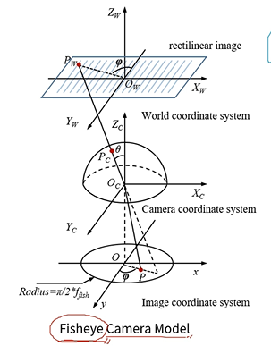

* Weak perspecive model
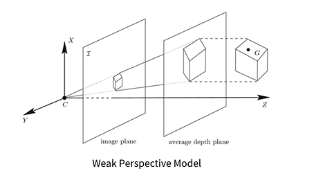

> 카메라의 렌즈 종류나 이미지 센서 종류에 따라 모델이 달라진다. 이럴 떄는 투영 행렬 식 등을 그대로 적용할 수 없다.

- - -

# Camera Intrinsic Calibration
## 카메라 캘리브레이션
카메라가 가지고 있는 고유한 특성을 파악하는 과정이다. 카메라 투영 행렬에 의해 고유한 두 가지 특성을 가진다.

* intrinsic(내부): 카메라의 내부적 특성. 렌즈와 이미지 센서와의 관계에서 파생되는 초점거리 등
* extrinsic(외부): 카메라가 대상을 촬영했을 당시의 위치와 자세에 관한 특성

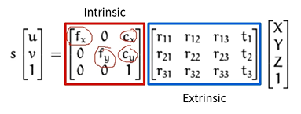

동일한 extrinsic을 가졌다고 했을 때, 동일한 위치에서 서로 다른 카메라로 동일한 피사체를 촬영해도 서로 결과가 다르다. 초점거리(f)가 클수록 피사체를 크게 촬영하는 등의 이유가 있기 때문이다.

extrinsic도 유사한 이유이다. 같은 카메라로 다른 위치에서 동일한 피사체를 촬영하면 그 결과가 다르다. 거리가 가까울수록 크게 피사체가 찍히기 때문이다.

따라서 두 특성 모두 캘리브레이션을 해야 한다.

## intrinsic
intrinsic 캘리브레이션은 초점거리(focal length)($f_x, f_y$)와 주점(princpal point)(이미지의 중심점)(이미지의 중점과는 조금 다른 의미)($c_x, c_y$)를 의미한다.

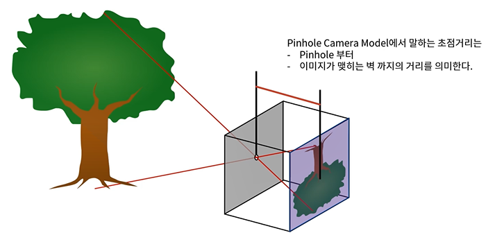

pinhole은 렌즈를, 벽은 이미지 센서를 의미한다.

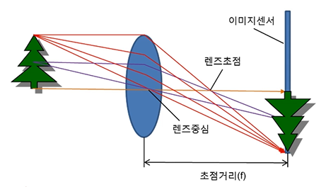

> 참고
* 초점거리 | https://darkpgmr.tistory.com/107
* 카메라 캘리브레이션(fx, fy 설명도 있음) | https://darkpgmr.tistory.com/32

초점 거리에 따라 피사체를 축소/확대한 것처럼 촬영할 수 있다. 

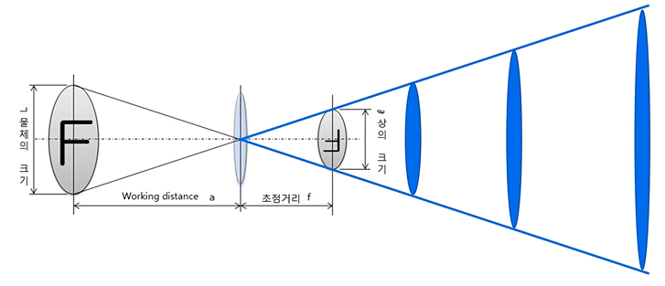

컴퓨터 비전에서 초점거리는 이미지 센서의 셀 크기에 대한 상대적인 픽셀 단위로 표시하나, 디지털 카메라에서는 초점거리의 단위 실제 물리 단위인 mm로(이미지 센서 CCD/CMOS와 렌즈 중심까지 거리) 서로 다르다.

이미지 센서 셀의 크기가 0.1mm이고 초점거리가 f=500픽셀이라면, 이미지 센서와 렌즈 중심 사이의 거리는 셀 크기의 500픽셀 배로, 50mm를 의미한다.

이는 곧 이미지 해상도에 따라 초점거리가 달라지는 이유가 된다. 이미지 셀의 크기에 대한 상대적 단위이기 때문이다.

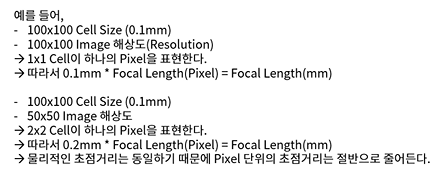

주점은 핀홀 카메라에서 이미지 센서에 직교하는 위치를 말한다. 이상적인 경우 $c_x = width / 2, c_y = height/2$이다.

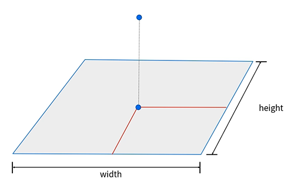

주점과 이미지 중심점(center point)은 다르다. 주점(렌즈 중심점)이 이미지 중심점과 일치해야 이상적이지만, 카메라 제조 공정에서 발생하는 다양한 이유로 일치하지 않는 경우가 있다. 이미지의 해석은 이미지 중심점이 아닌 주점을 기준으로 수행해야 한다.

intrinsic calibration은 intrinsic 파라미터를 얻는 과정이다.

$$
\mathrm{intrinsic} = \begin{bmatrix}
f_x & skew_cf_x & c_x \\
0 & f_y & c_y \\
0 & 0 & 1
\end{bmatrix}
$$

여기서 $skew_cf_x$는 이미지의 비대칭 계수(skew coefficient)를 말한다. 이미지 센서의 cell array의 y축이 기울어진 정도를 의미한다. 과거에는 필요했으나, 요즘은 거의 이런 경우가 없어서 0으로 놓아도 무방하다. 해당 값들은 픽셀 단위로 쓴다.

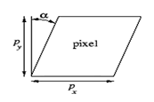

## 카메라 좌표계
### coordinate
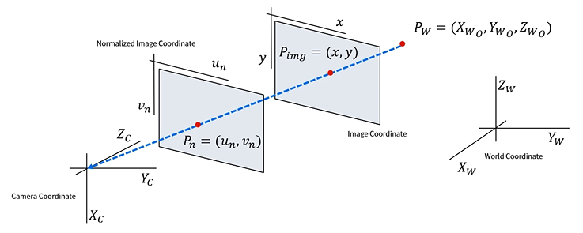

3차원 공간의 물체를 2차원 이미지 공간에 투영되는 과정을 설명하려면 좌표계가 정의되어야 하며, 4가지의 좌표계가 필요하다

| 좌표계| 영문표기| 기호|
|---|---|---|
| 월드 좌표계 | World Coordinate | $ X_W, Y_W, Z_W $ |
| 카메라 좌표계 | Camera Coordinate | $ X_C, Y_C, Z_C $ |
| 이미지 좌표계 | Image Coordinate | $ u, v $ |
| 정규 이미지 좌표계 | Normalized Image Coordinate | $ u_n, v_n $ |

### world coord.
우리가 살고 있는 3차원 공간의 좌표계이다. 임의의 한 점을 기준으로 좌표계를 설정할 수 있다. 월드 좌표계를 기준으로 물체의 위치는 $P_W = (X_{WO}, Y_{WO}, Z_{WO})$. 월드 좌표계로 카메라의 위치도 표현 가능하다.

### camera coord.
카메라를 기준으로 표현하는 좌표계. 일반적으로는, 카메라 렌즈가 바라보는 방향(종방향)을 $Z_C$, 카메라 아래쪽(지면 방향 / Z_C와 Y_C 평면에 수직인 평면)을 $X_C$, $Y_C$는 카메라의 오른쪽 방향이다.

일례로 카메라 좌표계를 월드 좌표계로 변환하려면 Z_C를 X_W로 바꿔야 한다.

### image coord.
실제 이미지로 표출되는 데이터를 표현하는 좌표계. 일반적으로, 왼쪽 상단을 원점으로 해서 column 방향을 u(또는 $x$)로, row 방향을 v(또는 $y$)로 한다.

### normalized image coord.
가장 중요한 개념

실제로 존재하지 않는 좌표계이다. 컴퓨터 비전에서 해석을 위해 정의한 가상의 좌표계이다. 초점거리를 1로 정규화해 가상의 이미지 좌표계를 사용함으로써 초점거리에 대한 영향을 제거한다. (초점거리가 카메라마다 다르기 때문에, 같은 물체를 같은 위치에서 서로 다른 카메라로 찍으면 이미지에서 다르게 표현되므로, 이미지 좌표계에서 서로 다른 위치에 존재한다.)

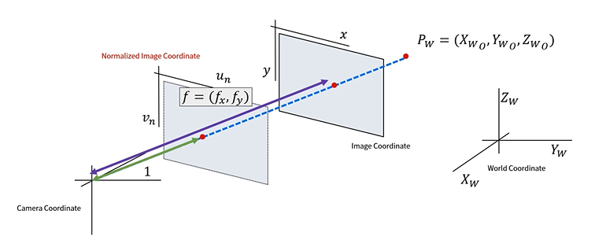

이미지 좌표계는 카메라 원점으로부터 초점거리만큼 떨어져 있는 이미지 평면이라면, 정규 이미지 좌표계는 1만큼 떨어진 가상의 이미지 평면이다.

## 이미지의 정규화
정규 이미지 좌표계와 이미지 좌표계 간 변환이다. 카메라의 intrinsic calibration(parameter)를 알면(=초점거리와 주점을 알면) 변환이 가능하다. 이는 카메라마다 다른 특성들을 완화해서 해석할 수 있게 한다.

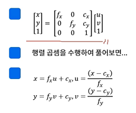

$$
\begin{bmatrix}
x \\
y \\
1
\end{bmatrix}
 = \begin{bmatrix}
f_x & 0 & c_x \\
0 & f_y & c_y \\
0 & 0 & 1
\end{bmatrix}
\begin{bmatrix}
u \\
v \\
1
\end{bmatrix}
$$

- - -

# Distortion
## 왜곡
실제 카메라는 핀홀 카메라 모델에서의 작은 구멍이 아닌 렌즈로 빛을 모은다. 핀홀은 렌즈가, 이미지가 맺히는 벽은 이미지 센서가 대응한다. 완벽한 핀홀 카메라는 빛이 하나의 점을 통과하나, 렌즈는 크기를 가지는 물체이므로 빛이 굴절된다. 빛의 굴절은 이미지 센서에 보이는 이미지를 왜곡한다.

왜곡은 렌즈 형상이 곡률을 가지는 구면이기 때문에 발생한다. 주점에서 멀어질수록 표현의 비율이 달라지므로 왜곡이 생긴다.

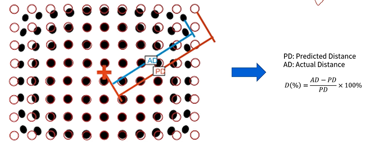

방사 왜곡, 접선 왜곡 등이 있다.

렌즈에 의해 발생하는 왜곡(방사 왜곡)은 아래의 두 가지 형태가 있다.

* barrel distortion: 중심부보다 외곽에서 큰 형태로 발생. 
* pincushion distortion: 중심부가 외곽보다 작은 형태로 발생

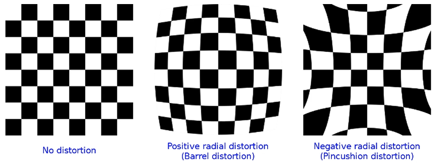

방사왜곡은 이미지의 중심으로부터 멀어질 수록 왜곡 정도가 심해진다. 왜곡의 크기를 매틀랩으로 그려보면 아래와 같다. 왜곡은 중심을 향하는 방향으로 발생한다.


접선 왜곡(tangential distortion)은 카메라 제조 공정에서 발생하여 렌즈와 이미지 센서의 수평이 맞지 않는 경우에 발생한다. 렌즈가 아닌, 렌즈와 이미지 센서의 관계에 의한 왜곡에 해당한다. 타원 형태로 왜곡의 세기와 방향이 발생한다.

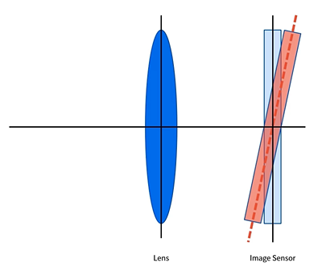 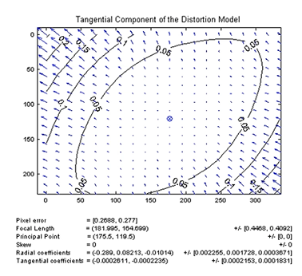

추가적으로는 원근 왜곡(perspective distortion)도 있다. 방사왜곡, 접선왜곡이 광학의 원리나 카메라에서 발생하는 왜곡인 반면, 원근 왜곡은 3차원 공간이 2차원 공간으로 투영되며 발생하는 왜곡이다. 사진을 찍을 때 이를 이용해 피사의 사탑을 떠받치는 식의 사진을 찍을 때 이를 이용한다. 이런 경우 이 원근감 손실을 교정할 수는 없다.

원근 왜곡이 아닌 경우엔, 사물의 실제 크기를 알고 있거나, 사물과 주변의 관계를 알거나, 추정이 가능한 기하학적 구조를 아는, 이 세 가지 방법을 이용해 3d vision을 한다.

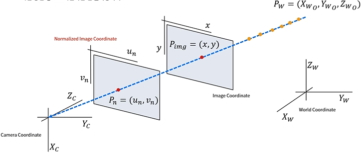

카메라 투영의 기하학적 정의를 다시 살펴볼 때, 파란색 점선(projection line)에 따라 P_W가 2차원 이미지에 빨간색 원으로 투영되기 때문에, 같은 라인에 존재하는 무수히 많은 점(주황색)은 모두 동일한 위치에 표시된다. 그러므로 부가적 정보나 조건 없이 이미지 내 정보만으로 3차원 공가나 정보로 복원하는 것은 불가능하다. 원근감 손실은 이렇게 복원 불가능하다.

손실된 원근감을 복원하기 위한 방법이 있긴 하다.

* 다수의 카메라를 사용하기: 동일한 시점에 촬영한 각 1장의 이미지만으로 3차원 정보를 추정할 수 있다. 각 카메라의 extrinsic param을 알아야 정확한 정보를 추정할 수 있다. 각 카메라의 좌표계(C)를 이용한다.
* 두 장 이상의 이미지를 사용하기: 같은 카메라로, 카메라가 움직이는 환경에서 연속된 이미지 정보를 쓴다. 카메라의 움직임 정보를 정밀하게 측정하고 추정해야 정확한 정보를 얻을 수 있다.
* 그 외 다양한 방법들이 있으며, multiple view geometry를 공부해야 하는 이유가 여기 있다.

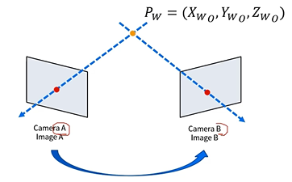

## 보정 수식
컴퓨터 비전에서 왜곡은 이미지의 기하학적 정보를 해석하는 데 방해요소가 되므로 왜곡을 보정해 사용해야 한다. 왜곡은 3차원에서 2차원으로 변환되는 과정에 발생한다.

extrinsic calib는 왜곡 모델에 불필요하고, 이 영향이 없다고 가정하면 행렬은 identity mat가 된다. normalized image plane에 투영한다고 하면 intrinsic mat을 계산할 필요도 없다. 따라서 수식은

$$
s
\begin{bmatrix}
x \\
y \\
1
\end{bmatrix}
 = 
\begin{bmatrix}
X_C \\
Y_C \\
Z_C \\
1
\end{bmatrix}
$$

이 되고, s도 고려하지 않는다 할때 정리를 다시 하면

$$
\begin{bmatrix}
u_{n_u} \\
v_{n_u}
\end{bmatrix}
 = 
\begin{bmatrix}
X_C / X_C \\
Y_C / Z_C
\end{bmatrix}
$$

이다. n은 normalized, u는 undistort의 약어이다. 왜곡이 고려되지 않았을 때라는 의미이다. 이제 왜곡 모델을 적용해보자. 왜곡이 없는 이미지에서 왜곡이 있는 이미지로 변환하는 식이다.

$$
\begin{bmatrix}
u_{n_d} \\
v_{n_d}
\end{bmatrix}
 = 
 (1 + k_1 r_u^2 + k_2 r_u^4 + k_3 r_u^6)
\begin{bmatrix}
u_{n_u} \\
v_{n_u}
\end{bmatrix}
+
\begin{bmatrix}
2 p_1 u_{n_u} v_{n_u} + p_2 (r_u^2 + 2 u_{n_u}^2) \\
p_1 (r_u^2 + 2 v_{n_u}^2) + 2 p_2 u_{n_u} v_{n_u}
\end{bmatrix}
$$

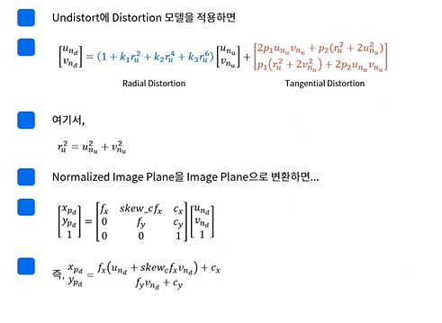

아래첨자 p는 plane, d는 distortion의 약어이다.

반대로 왜곡된 이미지를 왜곡 제거된 이미지로 변환하는 식이다.

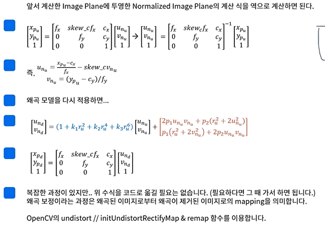

r은 주점까지의 거리이고, k, p들은 어떠한(?) 상수.

- - -

# Intrinsic Calibration Code
intrinsic matrix(intrinsic parameter, camera matrix)와 distortion coefficient를 계산해보자. 

참고할 사이트: https://docs.opencv.org/4.x/dc/dbb/tutorial_py_calibration.html

실습에는 체스보드 혹은 캘리브레이션 패턴이라는 보드가 필요하다. 각 그리드 셀의 정확한 크기를 알고 있어야 하고, 그리드의 사이즈를 알고 있어야 한다. 또한 Z값은 같아야 하므로 구겨짐이 없는 평면이어야 한다.

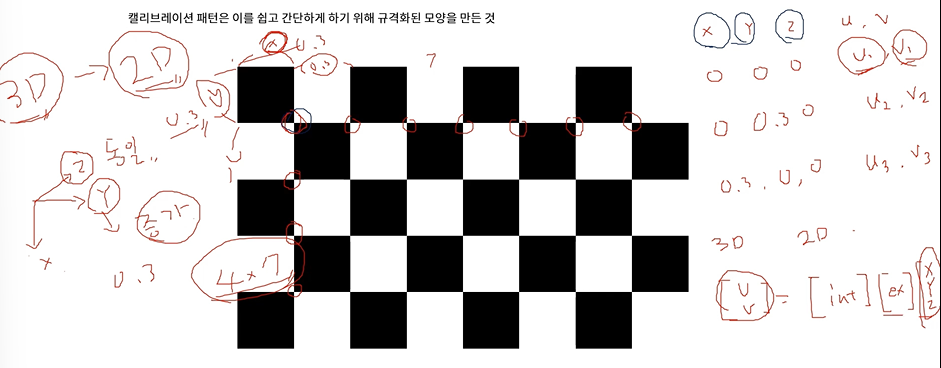

체스보드를 사용한 캘리브레이션 예제(opencv docs 제공)은 아래와 같다. (코너 검출)

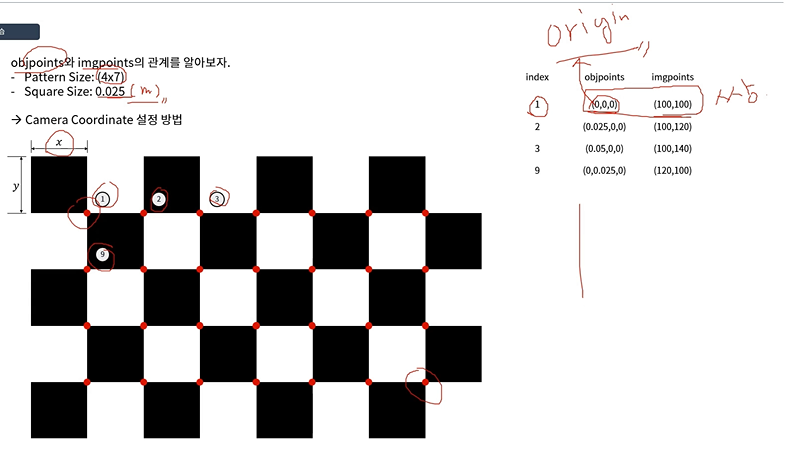

```py
import numpy as np
import cv2 as cv
import glob

# termination criteria
criteria = (cv.TERM_CRITERIA_EPS + cv.TERM_CRITERIA_MAX_ITER, 30, 0.001)

# prepare object points, like (0,0,0), (1,0,0), (2,0,0) ....,(6,5,0)
objp = np.zeros((6 * 7, 3), np.float32)    # 체스보드 사이즈 6 * 7이고 X, Y, Z이므로 3
objp[:, :2] = np.mgrid[0:7 , 0:6].T.reshape(-1, 2) * 0.025
    # 사각형 한 변의 길이 0.025를 곱해줌 [m]

# Arrays to store object points and image points from all the images.
# 아래 두 쌍의 배열을 올바르게 설정해야 한다. 두 쌍을 만들어내기 위해 findChessboard...을 쓰는 것.
objpoints = [] # 3d point in real world space (3차원 월드 공간에 존재하는 객체의 위치 정보)
imgpoints = [] # 2d points in image plane. (2차원 이미지 공간에 존재하느 객체의 이미지 픽셀 위치 정보)

images = glob.glob('*.jpg') # jpg로 끝나는 파일들의 목록을 가져옴

# objpoints를 카메라 좌표계, 즉 (0, 0, 0)으로 시작하면 첫번째 인덱스를 기준으로 카메라가 해당 위치에 있다고 가정함. 아래 사진 참고

for fname in images:
    img = cv.imread(fname)
    gray = cv.cvtColor(img, cv.COLOR_BGR2GRAY)

    # Find the chess board corners
    ret, corners = cv.findChessboardCorners(gray, (7,6), None)

    # If found, add object points, image points (after refining them)
    if ret == True:
        objpoints.append(objp)
        corners2 = cv.cornerSubPix(gray,corners, (11,11), (-1,-1), criteria)
        imgpoints.append(corners)

        # Draw and display the corners
        cv.drawChessboardCorners(img, (7,6), corners2, ret)
        cv.imshow('img', img)
        cv.waitKey(500)

cv.destroyAllWindows()
```

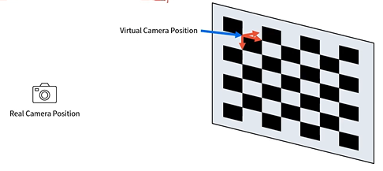

calibration에서 가장 핵심이 되는 부분은 아래와 같음
```py
objp = np.zeros((6 * 7, 3), np.float32)
    # 3차원 월드 공간에 존재하는 객체의 위치 정보
objp[:, :2] = np.mgrid[0:7 , 0:6].T.reshape(-1, 2) * 0.025
objpoints = []
imgpoints = []  # 2차원 이미ㅣ 공간에 존재하는 객체의 이미지 픽셀 위치 정보

## objp, imgpoints 쌍을 잘 정해줘야 함

for fname in images:
    ret, corners = cv.findChessboardCorners(gray, (7,6), None)
    if ret == True:
        objpoints.append(objp)
        imgpoints.append(corners)
```

OpenCV의 카메라 캘리브레이션 코드
```py
ret, mtx, dist, rvecs, tvecs = cv.calibrateCamera(objpoints, imgpoints, gray.shape[::-1], None, None)
    ## intrinsic
    # ret : 잘 되었는가 안 되었는가(??)
    # mtx : intrinsic matrix(parameter)
    # dist : distortion matrix, 왜곡 계수
    
    ## extrinsic
    # rvecs, tvecs : R 벡터, T 벡터 / 해당 이미지에서의 rvec, tvec이므로 이 값을 실제로 출렧해보면 이미지 개수만큼 나옴
    # OpecnCV에서 rvecs, tvecs를 extrinsic calibration이라고는 하지만 자율주행에서의 단어와는 차이가 있음
    # opecncv에서는 1번 점을 원점으로 함(objpoints에서(0, 0, 0)으로 설정) -> 그 점으로부터 카메라의 실제 위치를 구할 때 사용할 R 벡터와 T벡터를 그 점을 기준으로 함. -> 매 사진마다 R, T 벡터가 달라짐(상대적임. 진짜 카메라의 위치와 자세는 아님)
    # 따라서 우리가 지금까지 배운 RT와는 차이가 있음
```

opencv 왜곡 보정 함수들
```py
# 1번 방식
dst = cv.undistort(img, mtx, dist, None, mtx)

# 2번 방식
mapx, mapy = cv.initUndistortRectifyMap(mtx, dist, None, None, (w, h), 5)
remap = cv.remap(img, mapx, mapy, cv.INTER_LINEAR)
    # 1번 함수는 initUndistortRectifyMap()과 remap() 함수를 내부적으로 호출하고 있음.
    # RectifyMap을 계산하는 것은 카메라 matrix와 distortion coefficients를 알면 한 번만 계산하면 됨
        # 동영상이라고 하면 매번 계산할 필요가 없다는 뜻
        # 이는 while문 밖에 선언하고 remap만 while문 안에서 수행한다던지.
    # 두 함수를 분리해 카메라로부터 이미지를 받을 때 cv.remap( )을 적용하는 게 좋음
```

`getOptimalNewCameraMatrix()`함수: 카메라의 고유한 특징을 camera matrix라고 하는데, 왜곡된 사진에 대해 최적의 값으로 다시 계산해줌. 리턴으로 camera matrix를 보냄. initUndistortRectifyMap()나 undistort의 입력인 mtx로 들어갈 수 있음. 같은 결과를 calibrateCamera()에서도 얻을 수 있는데, 두 값을 각각 undistort()에 넣어보고 리턴인 dst를 비교해보자

- - -
