# intrinsic calibration 실습

실습 파일의 `images/info.txt`에 체크보드 관련 정보 있음. OBARD_WIDTH는 체커보드의 가로 점 개수, HEIGHT는 세로 점 개수를 가리킴. 한 칸의 사이즈가 0.025m임

코드의 설명은 코드에 직접 함

- - -

# projection points 실습
코드 참고

- - -

# perception application(2): 위치 정보 복원
## Reading Paper
!오래되었지만 꼭 읽어야 할 논문! Vision-based ACC with a Single Camera: Bounds on Range and Range Rate Accuracy(2003) // 모빌아이 CEO인 분이 저자(다른 논문들도 추천(geometry and photometry in 3d visual recognition(1992), trajectory trinagluation 3d reconstruction of moving points from a monocular image sequence(2000))) // 

컴퓨터 비전을 활용한 자율주행 perception을 공부하다면 논문 몇 가지를 추천

* abstract
    * 단안 카메라를 활용한 범위(깊이 정보, 거리) 등을 추정하는 방법을 다룸
    * 오래되었지만 지금도 다양한 응용으로 활용함
* introduction
    * 직접 범위(direct range): 라이다, 레이다, 스테레오 이미지 등 범위 정보를 직접 제공하는 것
    * 간접 범위: 범위 청조를 추정한느 방법(laws of perspective)를 사용하는 것
    * 논문에서는 간접범위를 사용해 상용 수준의 ACC를 만드는 것을 목표로 함
    * 사람의 시각 시스템(스테레오)의 베이스 라인은 사람의 손이 닿는 범위 및 더 번 거리에서 대략적으로 거리를 측정하도록 설계됨
    * ACC 어플리케이션은 사람이 시각적으로 측정할 수 없는 100m에 도달하는 거리 측정을 필요로 함
    * 따라서 이런 맥락에서 발생하는 질문 => 거리 제어에 필요한 즉정 정확도는 무엇?
    * 라이다와 레이다에 의해 제공되는 거리 정확도는 거리 제어에 충분. 사람의 시각 시스템을 보면 원근법만으로도 만족스런 성능 낼 수 있음
    * 단안 시각 시스템에서 도전 과제는 2가지
        * 대상 분할에 대한 깊이 정보가 부족함
        * 깊이 정보는 패턴 인식 기술에 크게 의존적
    * 논문의 핵심 질문 : 타겟이 검출된 상황에서 원근 법칙과 망막 발산(retinal divergence)을 사용해 ACC의 요구 정확도를 만족시킬 수 있을까?
* range
    * 원래는 이미지 자체만으로 거리 정보를 알 수는 없음. 실제 공간은 3차원이고 이미지는 2차원이라 방정식의 하나가 부족함. 이를 채우기 위해 원근법을 사용하기도 함 
    * 원근법을 사용하는 방법은 2가지 단서를 이용: 차랑의 크기, 차량 바닥의 위치
    * 도로면의 기하학적 정볼르 활용할 때 더 나은 결과 얻음. 
    * 평평한 바닥이고(조건1 // 내리막이나 오르막 말고) 광학 축이 노면과 평행하도록 설치된(조건2 // 카메라가 바닥으로 기울어져 있는 등을 제외) 카메라가 있다고 가정하면 카메라로부터 Z만큼 떨어진 노면은 이미지 높이 y에 투영됨($y = \cfrac{fH}{Z}$ (H는 카메라 높이, f는 초점거리)) 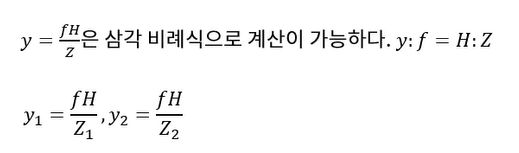
    * 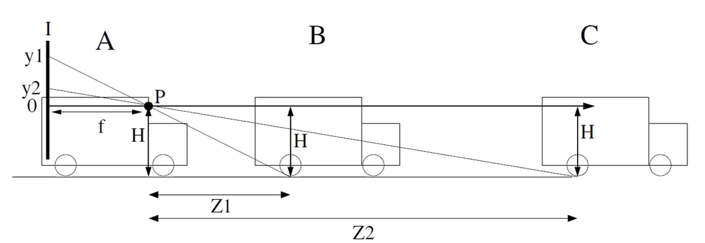
    * P는 카메라 핀홀 위치 // 핀홀이면 이미지 뒤집어지니까 실제 거리로 가까운 y1은 아래쪽에 맺힌다고 봐야 함
    * 비례식을 상요해 거리를 측정할 수 있음 -> $Z = \cfrac{fH}{y}$
    * 몇 가지 상황에서 오차 발생
        * 카메라 광학축이 노면과 평행할 수 없음. 수평선이 이미지 중앙에 위치할 수 없음
        * 카메라 장착 각도와 차랑의 움직임(pitch)에 의해 변화가 생길 수 있음
        * 이런 오차를 보정한다 해도 차량이 노면과 닿은 지점의 이미지 좌표를 결정하는 데 있음(현실 거리 정보는 실수이나, 이미지 좌표는 정수)
        * 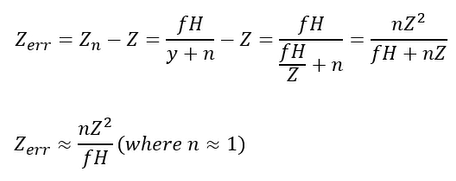
        * 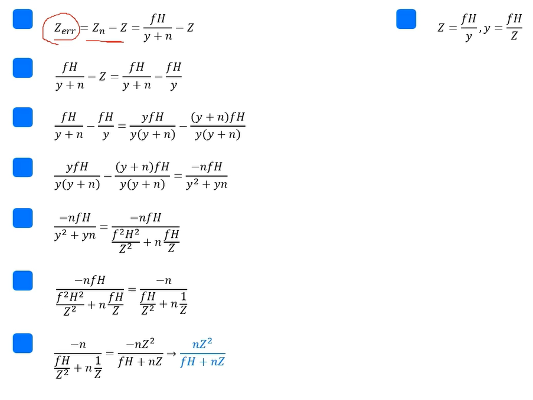
    * 거리(depth)오차는 2차적으로 증가하고, (멀 거리일수록 오차가 급격히 커짐) 타겟까지 거리가 증가함에 따라 거리의 백분율 오차가 선형적으로 증가. ex) 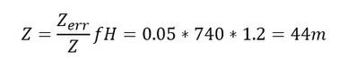
    * ACC에서는 거리의 비율이나 상대 속도가 중요. 일정 거리를 유지하고 있는 것이 중요. 따라서 너무 정확한 측정은 아니어도 됨
* range rate
    * 레이더 시스템에서는 도플러 효과로 범위 속도나 상대 속도ㅇ를 측정.
    * 비전 시스템에서는 이산 차분에서 $ v = \cfrac{\delta Z}{\delta t}$으로 계산됨
    * 두 개의 서로 다른 시점에서 Z에 대한 에러르 제거하면 정확한 측정값을 얻을 수 없음. 단순 이산 시간 차이만가지고 계산하면 부정확
    * 스케일 변경에 대한 계산 방법, 정확한 이산 시간 차이 계산  방법 소개함
    * Scale
        * 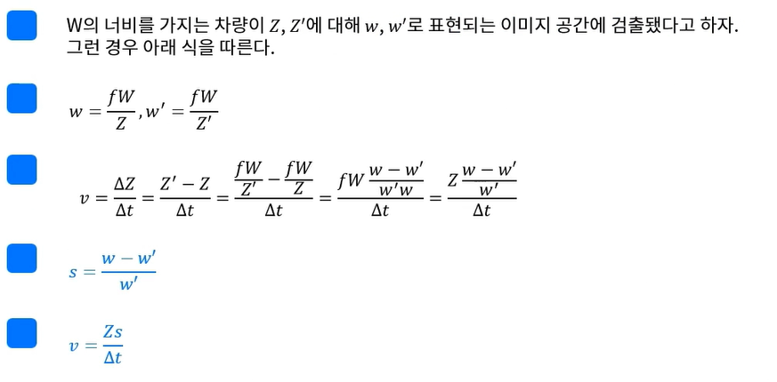
    * Error
        * 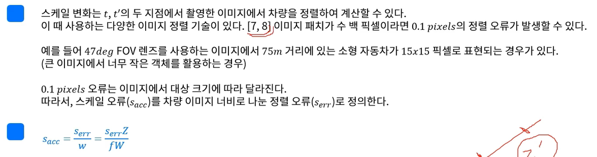
        * 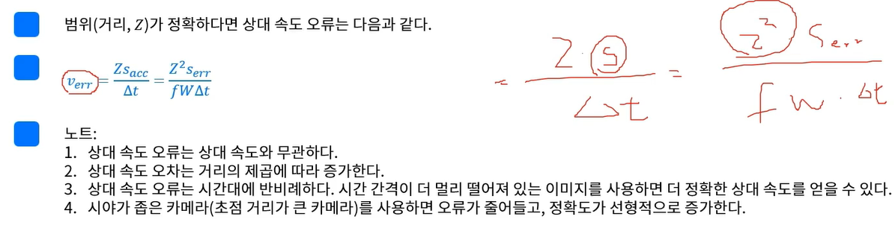
        * 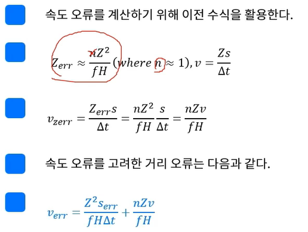
        * 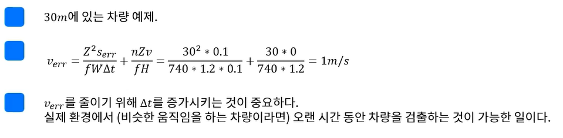
        * 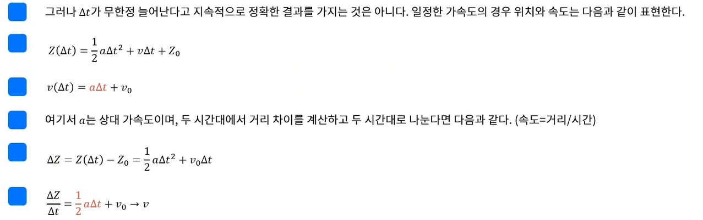
        * 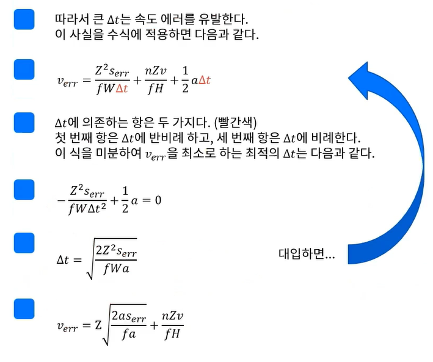
        * 최적의 $\delta t$는 거리 Z에 선형 속도 오류를 가짐
        * 가속도가 0인 경우ㅡ, 최적 $\delta t$는 무한대임. 실제로 시스템에서는 $\delta t = 2s$로 제한

## Geometrical Distance Estimation
## Geometrical Distance Estimation Code
## Additional

- - -

# Camera Extrinsic Calibration
## extrinsic
* 복습
    * 컴퓨터 비전에서 사용하는 좌표계: 월드 / 카메라 / 이미지 / 정규 이미지 좌표계
    * 카메라는 3차원 공간에 존재하는 물체를 2차원 공간에 투영하는 센서
    * extrinsic calibration
        * 월드-> 카메라, 카메라 -> 월드를 이해하기 위한 과정
        * 카메라가 실제로 존재하는 3차원 공간에 대한 정보 다룸
    * 컴퓨터 비전을 활용한 자율주행 분야에서 extrinsic cali 는 두 가지 활용을 위해 수행
        * 센서 퓨전을 위한 정보로
        * pereception application을 위한 정보로
    * extrinsic cali는 환경과 조건에 따라 목적과 방법이 달라짐. 다양한 방법론을 소개하고 자신에게 맞는 고유한 환경 찾아야 함. 범용적 솔루션 없음(센서 종류, 개수, 장착 위치 증 변수 많음)
* 자율주행차의 경우, 모든 정보를 자동차 좌표계에 정보를 통일함. 후륜 구동축의 중심 지면을 원점으로 함(ISO8855기준).

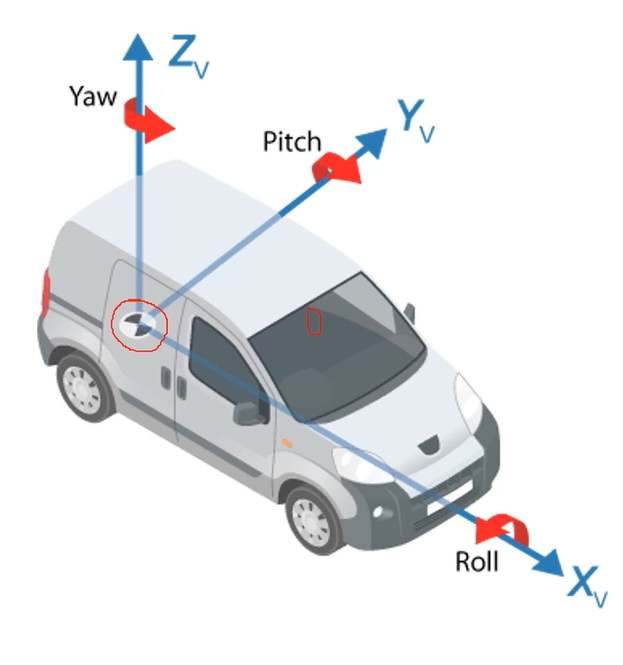 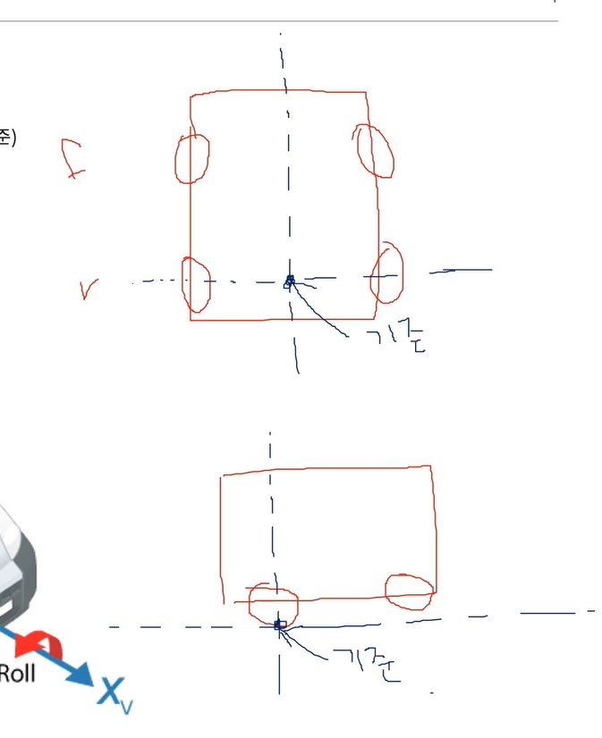 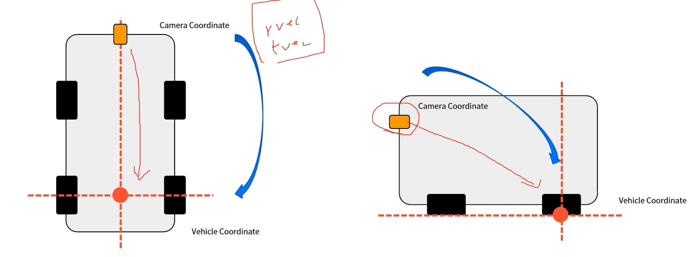

* 자율차의 센서마다 매우 다양. 카메라는 카메라 좌표계를, 라이다, IMU, GPS다 다름. 이를 통합하는 과정이 필요-> 센서 퓨전 영역
* 그러므로 vehicle coordinate를 기준으로 한 카메라의 장착 위치와 자세를 rvec, tvec을 사용해 파악해야 함

## calibration
intrinsic에서 `objpoints`, `imgpoints`로부터 calibrateCamera 결과로 rvecs, tvecs를 받음 -> 각 이미지마다 원점이 되는 위치로부터 실제 카메라의 위치와 자세 정보 의미

 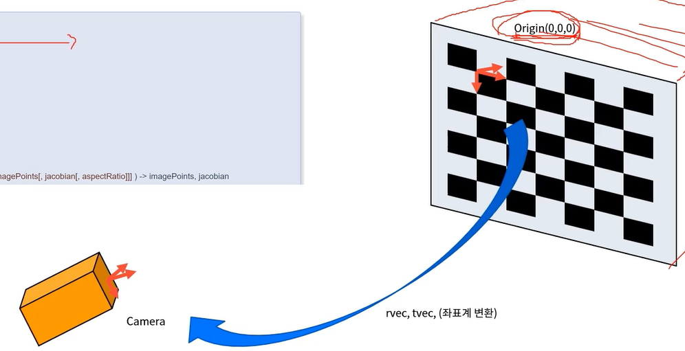

* 해당 rvecs, tvecs를 사용해 objpoints를 투영하면 해당 평면의 3차원 물체가 투영됨. 그러나 카메라가 존재하는 공간은 3차원이므로 extrinsic cali의 origin을 체스보드로 설정하기 어려움. 무수히 많은 rvecs & tvecs 존재
* 따라서 objpoints의 origin(자동차 후륜축 점)을 어느 한 점으로 설정하고 캘리브레이션을 하면 해당 origin으로부터의 카메라 rvec, tvec을 얻을 수 있음
* 아래 사진에서의 tire clamps와 distance meter를 사용해, 후륜 축으로부터 거리 파악 -> 두 개의 거리 측정기 사요해 cliabration pattern과 차량의 수평 조절 가능 

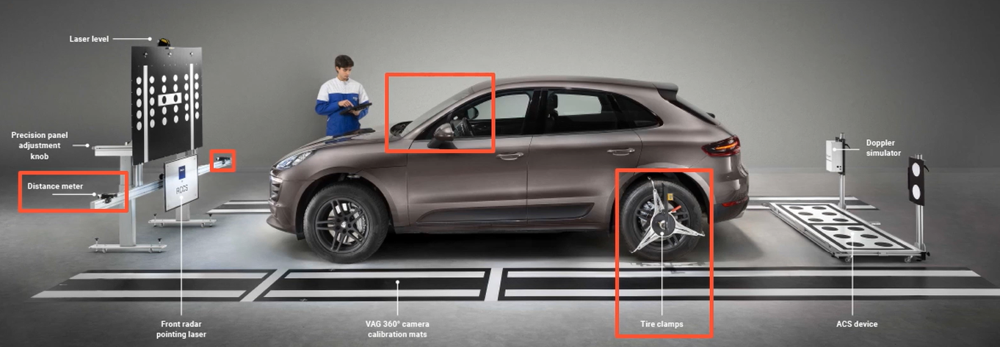

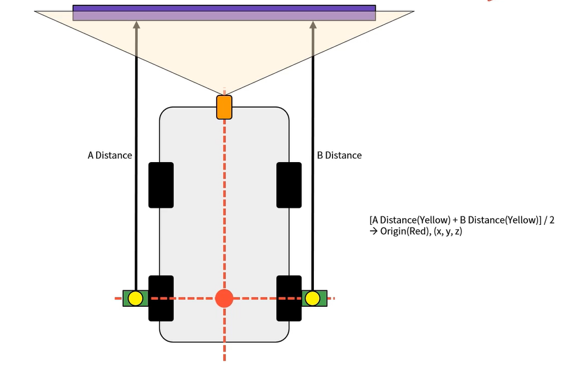 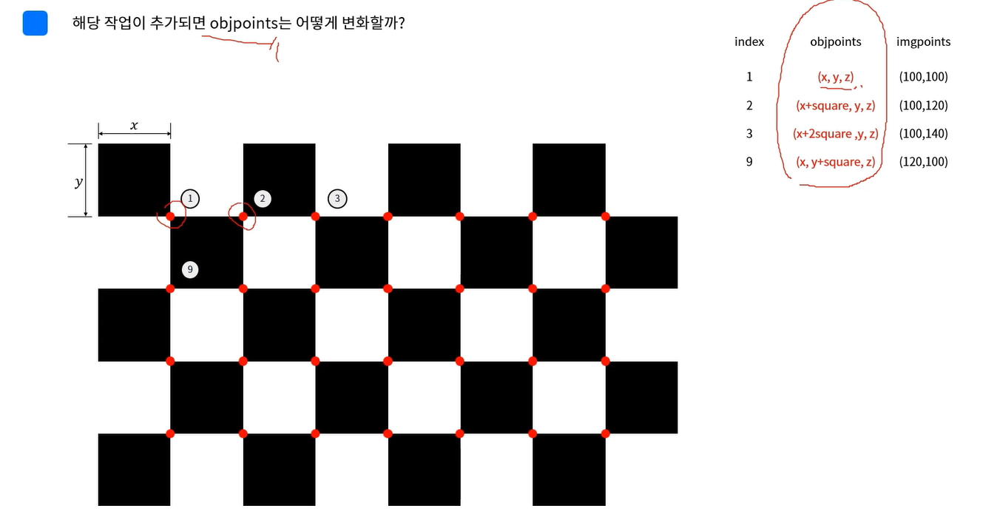

왼쪽 사진에서 빨간 점이 origin이 됨

objpoints를 이용해 카메라의 위치와 자세를 계산하기 위해서는 PnP(Perspective -n-Points)문제를 풀기 위해 sovlePnP 함수를 사용함. intrinsic matrix(`mtx`, `dist`)가 필요함 (참고: https://docs.opencv.org/3.4/d5/d1f/calib3d_solvePnP.html)

```py
retval, rvec, tvec = cv.solvePnP(objpoints, imgpoints, mtx, dist)
```

실제로는 다수의 보드를 사용해 캘리브레이션을 하기도 함.

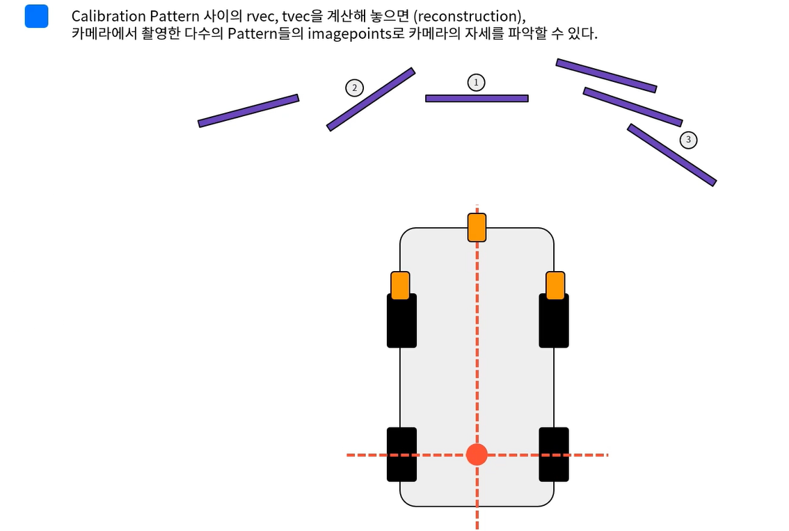

## 카메라와 라이다 퓨전
extrinsic calibration의 대표적 예 중 하나가 카메라-라이다 캘리브레이션. 3차원 데이터를 출력하는 라이다 센서는 카메라와 데이터 퓨전을 통해 객체의 depth 정보를 획득. 라이다에서 카메라로 가는 rt 행렬을 구해서 카메라 좌표계로 옮기는 게 핵심(3d object point <-> 2d img point)

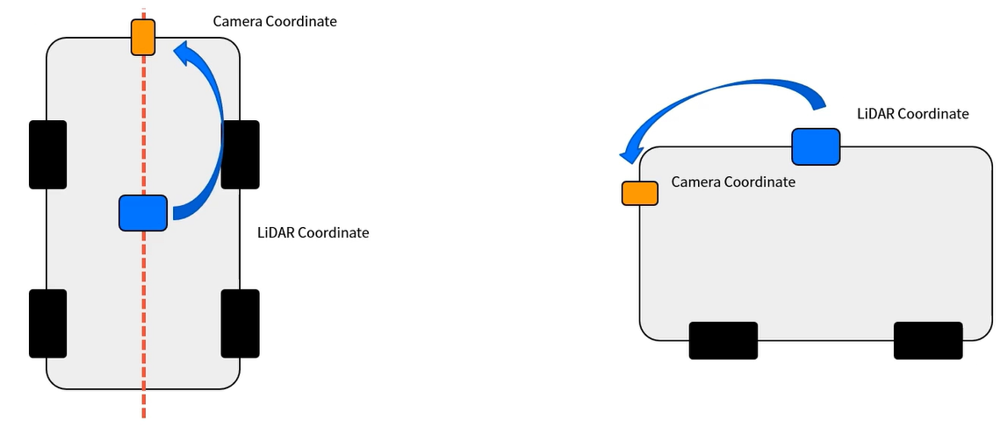

카메라-라이다 캘리브레이션 기본 원리도 비슷. extrinsic 의미를 이해하는 게 중요. 

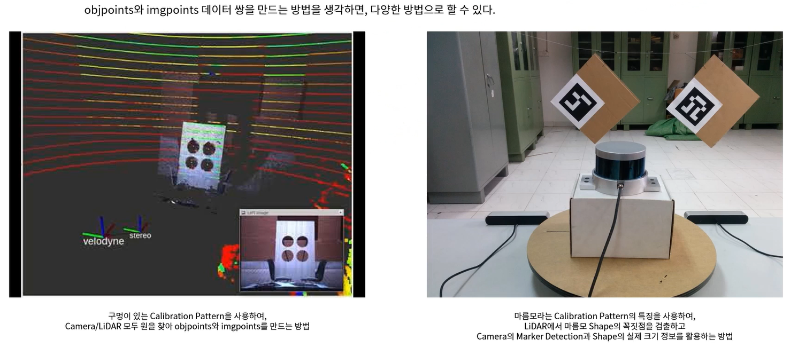

이렇게 얻은 objpoints와 imgpoints로 PnP문제를 풀면 Lidar -> cam의 rvec, tvec을 계산할 수 이음. 라이다 데이터와 함께 projection하면 Iamge 위에 LiDAR 데이터 올릴 수 있음. `projectPoints()`이용. 단, 이렇게 얻은 rvec과 tvec으로 이미지 데이터로 3차원 공간 정볼르 복원할 수는 없음. 무수히 많은 해가 존재(축 위에 수많은 2d가 존재하므로). 또한 라이다의 범위가 카메라 범위보다 넘을 수 있으므로 이를 제외해주는 작업도 필요

이미지 해상도와 겹침을 활용해 불필요한 정보 제거해야 하는 것이 중요. 아래 그림에서 아래쪽 빨간 원도 투영되지 않도록 반대쪽은 제거


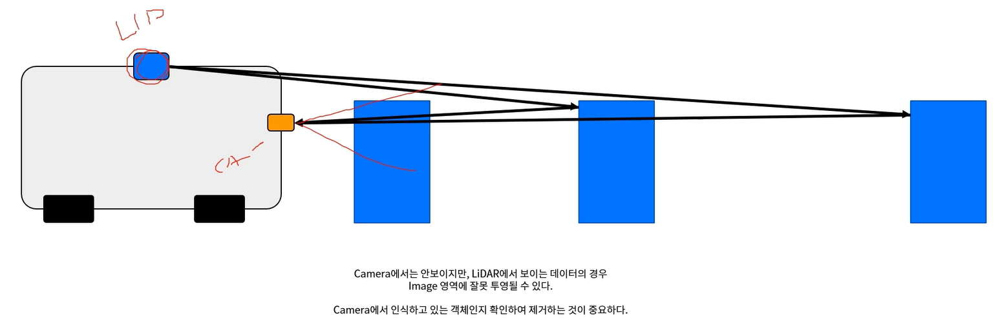
