Week14 Day1 : Perception Project

# geometrical distance estimation
저저번주에 읽은 논문을 통해 컴퓨터비전에서 활용하는 기하학적 방식의 객체의 거리(위치) 추정 방식을 알아봄. 보다 일반적 내용으로 정리하고 그 외 다른 방식이 있는지 알아보자

## projection method
첫 번째 방법인 '카메라 투영' 활용 방법이다. projection의 기하학적 구조에서 $P_W$와 $P_{img}$의 관계를 이용한 방법이다.

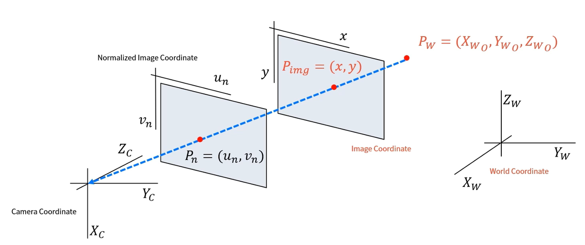

아래 사진이 투영의 기하학적 구조를 다른 그림으로 표현한 것이다. 아래 사진에서 P가 핀홀 지점(카메라 위치)이고 I 평면이 이미지이다. A에 카메라를 장착하고 B차량을 촬영하면 B차량의 타이어 지점이이 이미지의 y1에 대응한다.

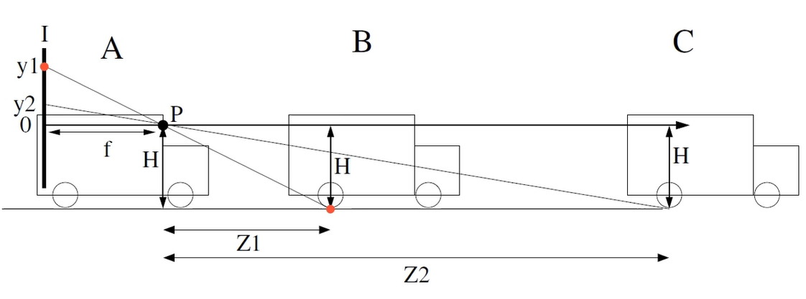

위 방식은 삼각형 비례식을 이용한 것으로, y1 : x1 = y2 : x2이므로 x2 = x1 * y2 / y1임을 이용

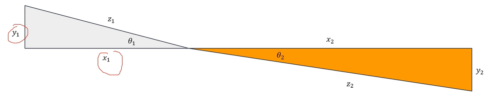 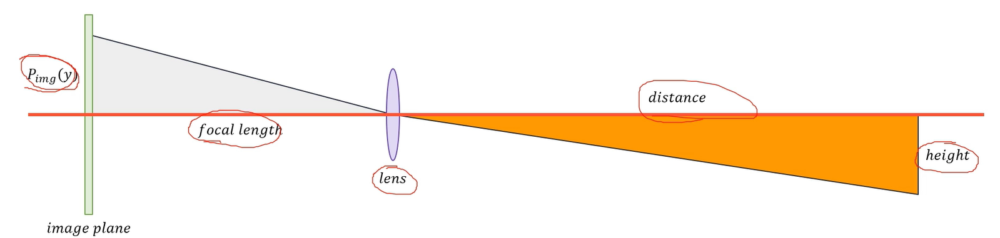

pinhole 카메라 모델을 삼각형에 대입하면 된다. $(distance) = (focal length) * (height) / P_{img}(y)$ 위 내용을 3차원에 표현하면 아래와 같다.

$ P_{img}(y) : f_y = f : Z$이므로 $Z = \cfrac{f_y \times h}{P_{img}(y)}$라 object의 높이 정보가 필요함

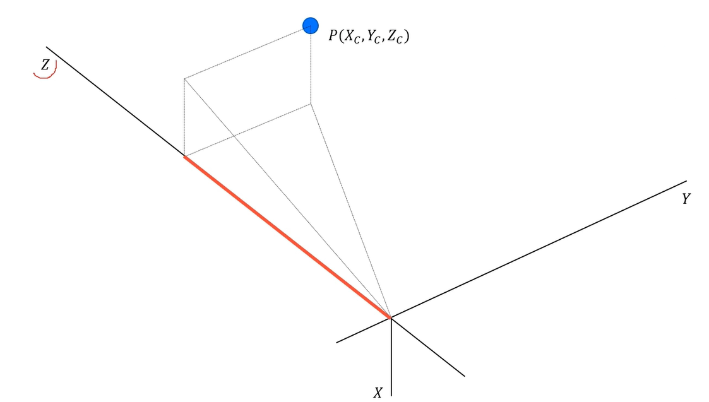

지금까지 논문에서의 방법인 종방향(아래 사진에서 빨간 색)에 대한 거리 정보 Z를 추정한느 방법이었다. 횡방향(파란색)에 대한 거리 정보 추정은 어떻게 할까? 객체가 지면에 붙어있지 않는 경우는?

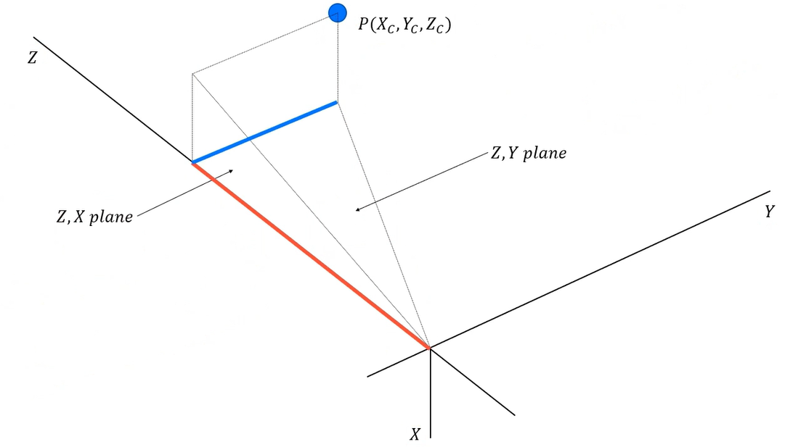

이는 카메라의 특성, 대상 객체와의 기하학적 조건을 알면 해결할 수 있다. FOV(Field of View)를 사용하는 방법을 알아보자. FOV가 50도라면 좌우 50도씩 총 100도를 보게 된다.

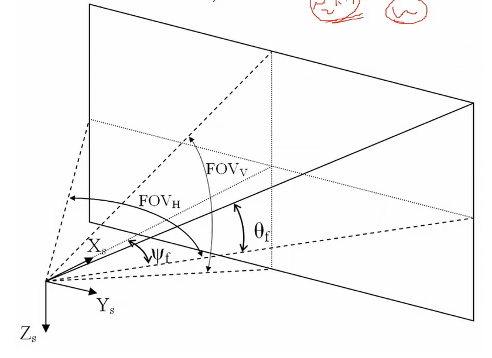

FOV를 이용한 projection 기하학적 정리는 아래와 같다. D_O는 거리(m)이고 D_f는 렌즈와 이미지 센서 간 거리이다. focal length인 F와 헷갈리진 말자. 렌즈 중앙 가로선으로부터 위아래로 정해지는 FOV_H를 가지고, 이미지 내 물체의 세로 위아래 위치로 각도를 구할 수 있음. 사진에서 alpha/2 같은 의미

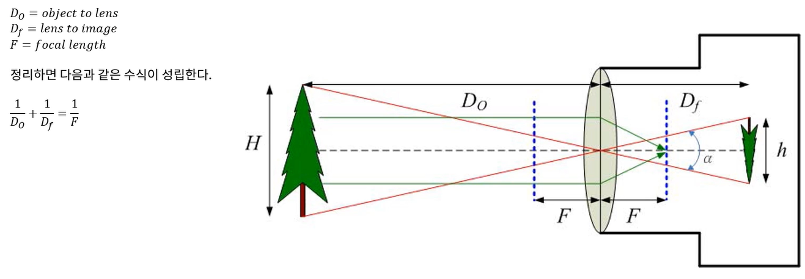 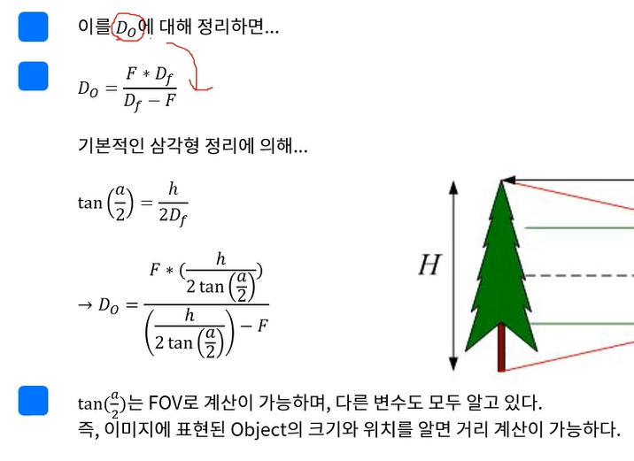

설명을 위한 가상의 카메라와 intrinsic, FOV를 설정하자

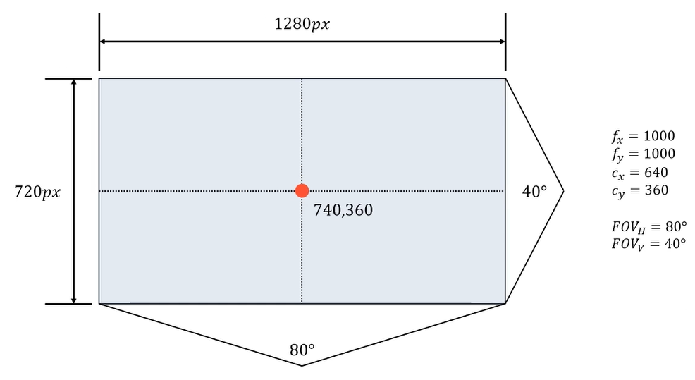

가상의 객체(통행금지 표지판)가 R=0.5m이 검출되었다고 하자 (width=1, height=1)

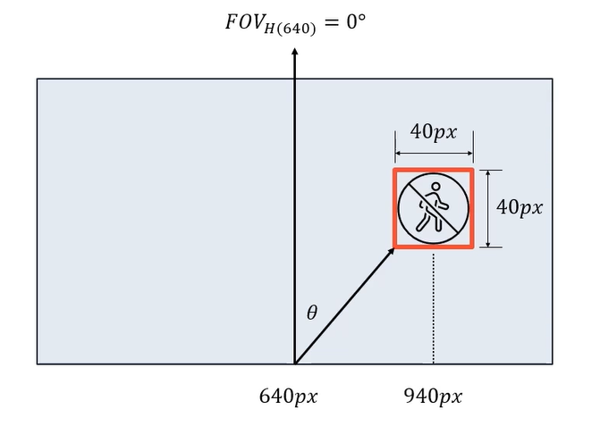

표지판이 카메라 광학축으로부터 얼마만큼의 방위각(azimuth)를 가지는지 파악해야 한다. FOV_H=80이므로 이미지 중심으로부터 오른쪽 끝까지는 40도가 최대이고, 표지판의 중심을 기준으로 했을 때 $azimuth = \cfrac{\delta x}{640} \times 40 = \cfrac{300}{640} \times 40 = 18.75$이다.

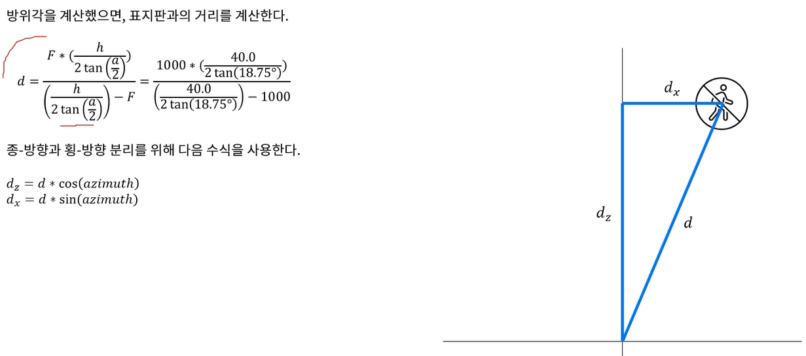

아래 그림에서 표지판의 좌상단을 a, 우상단을 b라고 했을 때 

$$
r_a : f = d : R_a \\
r_b : f = d : R_b
$$

가 되고 이를 다시 정리하면

$$
d = \cfrac{r_a \times R_a}{f} = \cfrac{r_b \times R_b}{f} \\
r_a \times R_a = r_b \times R_b \\
r_b - r_a = 40px \rightarrow d
$$

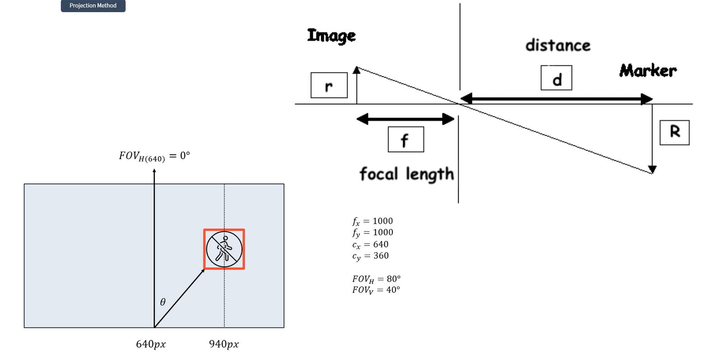

단, 이 때는 카메라의 위치와 지면으로부터 객체의 높이 등이 매우 중요하므로 extrinsic 캘리브레이션이 필요함

## perspective projection method
### 복습
두 가지 방법으로 객체의 위치(거리)를 추정했다.

1. 카메라와 대상 객체의 기하학적 조건을 활용 : 카메라의 설치 높이 & 대상 객체가 3차원 공간에 존재하는 특수 조건 활용. extrinsic calib 정보 활용
2. 카메라와 대상 객체의 특성을 활용 : 카메라의 고유한 특성(intrinsic, sensor & lens 속성)과 대상 객체의 실제 크기 정보 활용. extrinsic calib 정보 의존성이 상대적으로 낮음

두 방법 모두 복잡한 기하학적 변환이나 수식이 있다는 단점이 있다.

지금부터 할 것은 평면 변환(plane transform)이다. 이것의 큰 단점은, 객체가 평면과 관련이 있어서 평면에 대한 정의가 가능해야 한다는 점이다.

### transform
homography(호모그래피)는 실용적이며 굉장히 간단한 방법이다. 그전에 평면과 평면 변환에 대해 알아야 한다. 투영(projection)은 3차원 공간에 존재하는 대상을 2차원 이미지 공간(평면)에 투영하는 과정이다. 이미지를 다룬다면 1개 이상의 평면을 언제나 사용하고 있으며, 이를 image plane이라고 한다.

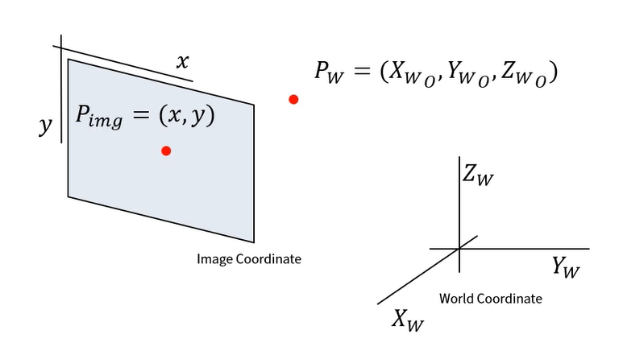

복잡한 투영과정의 그림을 간소화하면 위 오른쪽과 같다. 3차원 공간의 어떤 점을 2차원 평면에 투영한 것으로 간소화한 것이다. (3차원 공간은 무한의 평면을 가지고 있다.) 3차원 공간을 하나의 평면으로 자른다면 결국 2차원 공간과 2차원 공간의 변환(transform)으로 생각할 수 있다. 2차원 평면 상의 변환은 쉽고 간단. 

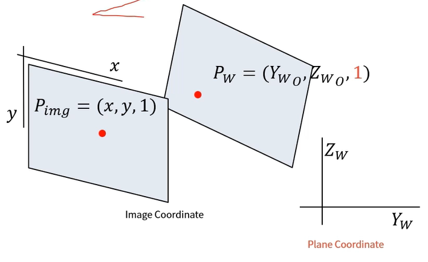

위 그림은 3차원 공간 상에 놓인 하나의 2차원 평면을 의미. 따라서 homogeneous 좌표계로 표현. (Z축이 사라짐) -> 평면과 평면의 변환 문제로 축소됨. Z=1이 됨은 투영이라 볼 수 있음

homogeneous 좌표계를 사용하는 이유?

우리가 보는 이미지 공간은 차원이 한 단계 더 높은 공간에서 투영선(projection ray)으로 이어져 있다. 아래 그림에서 파란 선에 해당한다.

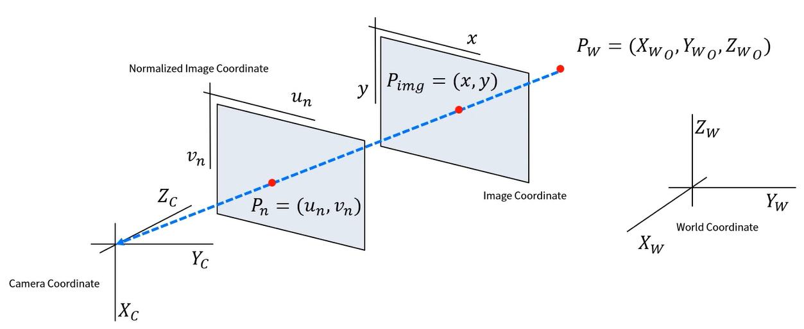 

이미지에서 본 점은 P_{img} = (x, y)로 표현 가능하나, 이미지보다 차원이 높은 공간에서 이미지 평면의 좌표를 어떻게 나타내나.

초점 거리는 렌즈 ~ 이미지 평면 거리이고, 정규 이미지 좌표계는 렌즈로부터 거리가 1인 가상의 평면이다. 카메라 좌표계를 기준으로 보면, 정규 이미지 평면의 점 (u, v)는 (u, v, 1)이고 이미지 평면은 (x, y)을 (fx, fy, f)라고 할 수 있다. 결과적으로 투영선 위의 세 점을 모두 정규 이미지 평면의 점의 scale up한 형태로 표현하게 된 것이다. 이것이 homogeneous 좌표계이다.

즉, 이미지에 맺힌 특정 대상은 3차원 공간에 유일하고, 유한한 위치에 존재하나, 2차원 공간으로 투영되는 과정에서 무한개의 점으로 표현이 가능하다. 그러나 이는 어떤 이미지 공간에 투영하는 가에 따라 달라지는 것이지, 그 대상은 동일하다. 

Projection은 P(X, Y, Z) -> P(u, v)의 변환 관계를 파악하는 것이고, Inverse-Projection은 P(u, v) -> P(X, Y, Z)의 변환 관계를 파악하는 것이다.

homogeneous coordinate에서 다음의 좌표는 모두 같은 대상이다. 모두 동일한 점 P(x, y)에 투영된다.

$$
P(wx, wy, w) \\
P(2x, 2y, 2) \\
P(x, y, 1)
$$

이미지 평면에서 정규 이미지 평면으로 변환하는 것이 평면 변환(projection transform)의 한 종류이다. 이 경우, 평면의 좌표계 기준은 변하지 않았으나 변화하는 형태로도 변환이 된다. 이 말은 아래와 같다.(???)

1. euclidean geometry에서는 평행하나 두 선이 절대로 만나지 않는다고 한다.
2. 우리는 차선이 서로 평행함을 알고 있다
3. 사진에서 보면 평행한 두 차선은 만나지 않지 않는다.(만난다) 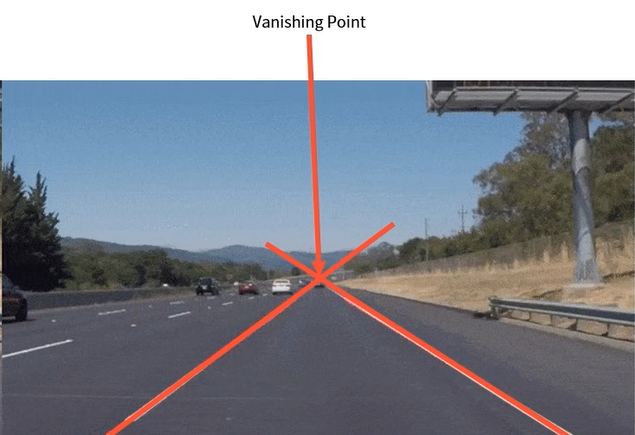

즉 euclidean geometry에서 평행한 두 차선이 projective & homogeneous geometry에서 만나는 지점을 소실점(vanishing point)라고 한다.

이러한 projective geometry의 성질을 이용해 이미지 평면을 다른 평면으로 변환하는 것도 가능한데, 이 대표적 예가 bird eye view(BEV) 변환이다. BEV로 변환할 '다른 평면'을 정의하는 데 주의해야 한다

자율주행 인지에서는 객체의 위치를 추정학 ㅣ위해 BEV를 사용하기도 한다. 카메라 뷰에서는 이미지에서의 위치, 클래스를 찾아낸다면 BEV에서는 3d localization을 하는 식이다. 그러기 위해 BEV 전환된 평면은 단순히 픽셀 단위가 아닌 물리 단위(m)여야 한다.

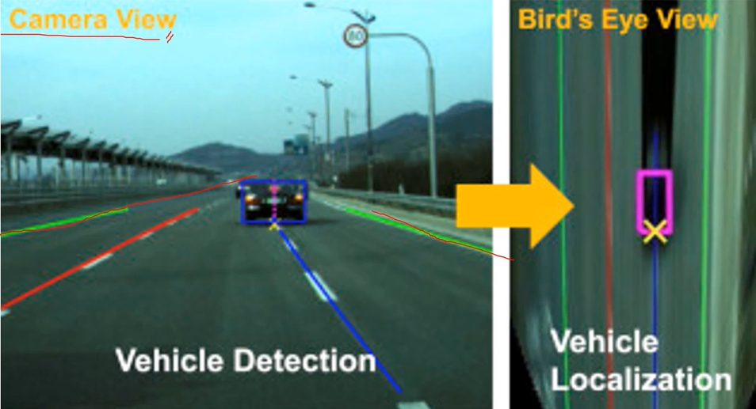

아래 그림은 보다 일반적인 상황이다. image plane을 virtual view가 바라보는 시점으로 ground plane(지면, m단위)으로 변환(transform)하는 과정이다. (u, v)는 픽셀 단위, (x, y)는 m 단위이다.

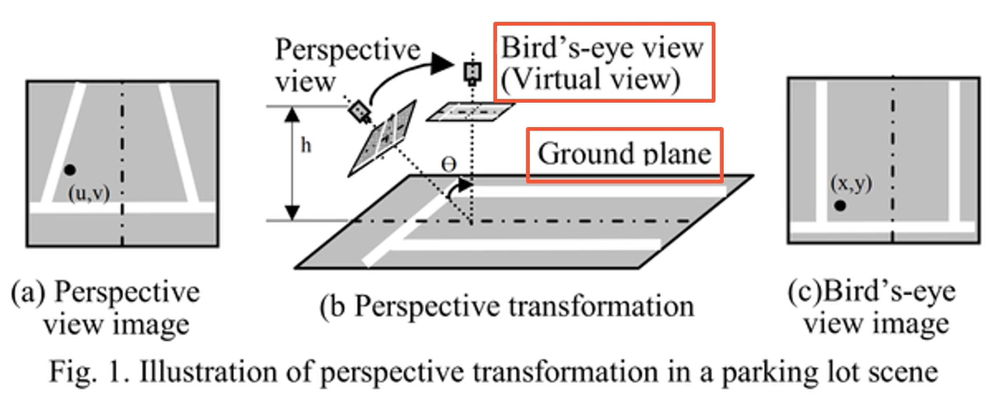

이미지 평면에 존재하는 (u, v)좌표계 스케일을 지면에 존재하는 (x, y) 좌표계 스케일로 변환하는 방법? 픽셀이라 부르는 데이터가 이미지 해상도를 의미한다는 생각을 깨야 한다. 

픽셀(pixel) = 2차원 좌표계에서 데이터를 부르는 단위 / 복셀(voxel) = 3차원 좌표계에서 데이터를 부르는 단위.

이미지는 2차원 좌표계를 사용하므로 픽셀을 쓰는 것이지 픽셀이 이미지는 아님에 주의하자.

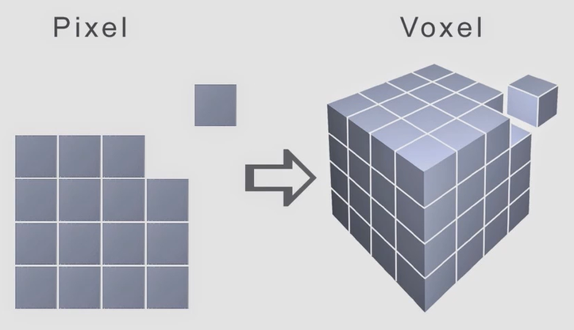

OpenCV에서 제공하는 튜토리얼이 homography와 perspective transform을 학습하기에 적절하다. 실제로는 intrinsic, extrinsic을 알고 있어야 하지만 지금 예제에서는 가정하고 한다.

- - -

# Geometrical Distance Estimation Code
## 개요
> https://docs.opencv.org/4.x/d9/dab/tutorial_homography.html 을 참고!!!

OpenCV에서는 평면 변환을 위해 `getPerspectiveTransform()`과 `findHomography()` 두 함수를 제공하나, 둘은 같은 함수이다. 4개의 포인트를 입력과 출력으로 쓴다면 전자를, 그 이상이라면 후자를 쓸 수 있다는 차이 정도이다. 후자에서는 입력된 포인트들을 가지고 변환 행렬을 계산하는 데 오차가 되는 이상치를 제거하는 방식(예: RANSAC)이 존재한다. 입/출력 포인트쌍이 4개 이상이고, 쌍 데이터에 존재하는 오차를 알아서 제거해주길 원한다면 후자가 낫다.

원근 변환(perspective transform)과 homography(projective transform, 투영 변환)은 본질적으론 동일하다. 원근 변환은 투영 변환이나, 투영 변환이 반드시 원근 변환일 필요는 없음. 개념과 변환의 결과를 동일하나, 투영 변환이 조금더 상위 개념.

평면을 기준으로 변환하는 것이 쉽고 편한 이유는 무엇일까. 이전에 읽었던 논문에 따르면 카메라와 지면이 서로 평행함을 가정했다. 실제로 카메라와 지면이 완벽하게 평행할 수 없기에 카메라 자세를 파악하는 별도 알고리즘을 적용해야 했다. 따라서 이미지 취득 - 소실점/소실선을 이용한 카메라 자세 추정 - 객체 거리 추정 이라는 과정이 필요하다. 반면 평면 변환의 경우 이미지와 타겟이 되는 가상의 평면에 대한 변환 과정을 다루므로 카메라와 지면이 평행하지 않아도 된다. 카메라의 tilt(혹은 pitch)에 대한 영향이 없다.

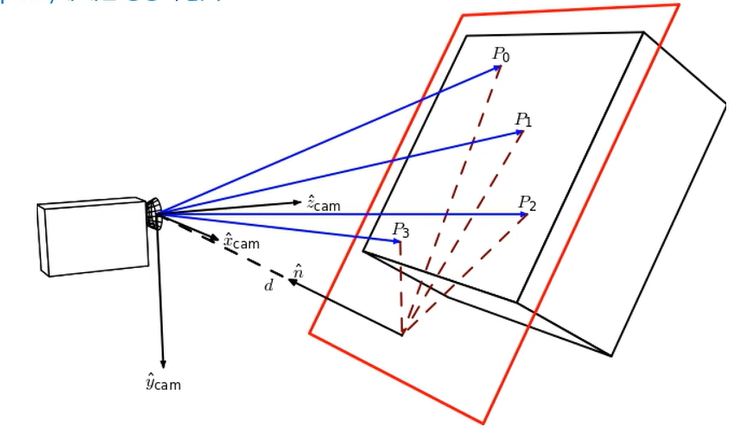

## 코드
homography를 사용하는 코드를 살펴보자. 지금까지 학습한 내용의 대부분이 있는 종합예제이다.

### part 1
* Step A: 왜곡된 이미지에 대해 보정을 하기 위해 Camera Intrinsic calibration을 진행
* Step B: calibration pattern에 존재하는 특징(코너)를 검출. imgpoints, objpoints의 쌍 데이터를 만드는 게 중요
* Step C: 카메라 캘리브레이션 정볼르 획득한다.
    * ret: RMS(Root Mean Square) 오차. extrinsic calib 정보와 objpoints를 가지고 각 이미지에 재투영을 하고, image에서 검출한 calib pattern에 대한 impoints와 비교해 오차를 계산함. 값이 낮을수록 캘리브레이션 잘 된 것
    * mtx: intrinsic parameter
    * dist: distortion coefficients
    * rvecs: 각 이미지에 대한 카메라 좌표계에서의 rotation
    * tvecs: 각 이미지에 대한 카메라 좌표계에서의 translation
    * rvecs, tvecs는 각 이미지에서 설정한 objpoints의 원점(0, 0, 0)에 대한 실제 카메라의 extrinsic calib 정보임
### part 2
* Step A: homography mat를 계산하기 위해 원본이 되는 이미지를 선택. img1은 원본 이미지, img2는 대상 이미지. findChessboardCorners()를 사용해 transform의 pair 데이터 결정. pair 데이터를 쉽게 생성하기 위해 이미지를 사용함. 추후 활용할 때는 변환의 대상이 되는 데이터는 이미지가 아니라 pair데이터임에 주의
    * 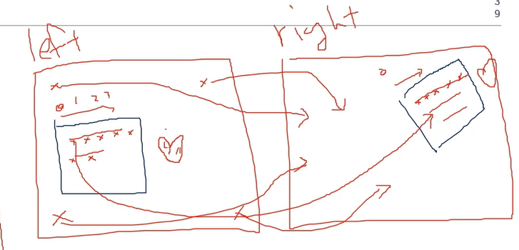
* Step B: homography mat를 계산함. 이미지가 아닌 corners1를 src로, corners2를 dst로 사용함에 주목. N개의 쌍 포인트를 사용해 변환 행렬을 구함이 중요. cv.RANSAC은 여러 개의 pair 데이터르 사용하면서 내부적으로 오류가 있는 데이터는 제외하는 알고리즘
* Step C: 결과를 확인함. cv.line() 함수를 사용헤 쌍 데이터가 어떻게 변환되었나 확인. cv.warpPerspective 함수로 homography mat 이미지 자체를 변환해봄
    * 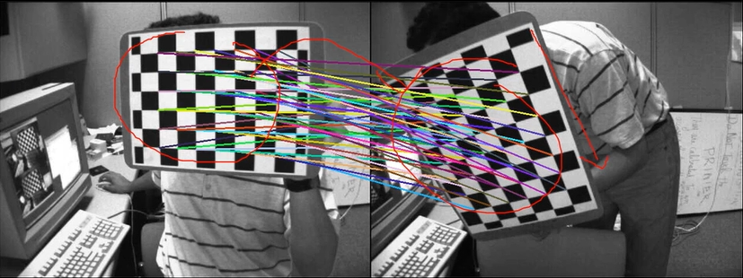

### 추가: ground plane으로 변환
homography mat로 카메라의 extrinsic 정보를 추출할 수 있다. 아래 그림처럼 카메라의 POSE를 그리는 게 목표이다. `drawFrameAxes()` 함수를 사용한다.

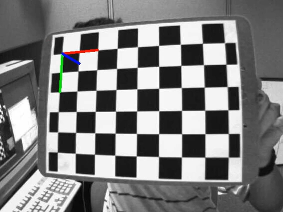

> https://docs.opencv.org/4.x/d9/dab/tutorial_homography.html 와 https://docs.opencv.org/3.4/d7/d53/tutorial_py_pose.html 참고!!

이전까지 예제로 살펴본 데이터는 이미지 -> 이미지 변환이었다. homography는 임의의 평면도 변환이 가능하므로, 지면에 존재하는 실제 포인트로 homography연산도 가능하다. 차량에 장착된 카메라가 지면과 평행하지 않으면 별도 작업이 필요하나, homography를 사용하면 평면과 평면 간 변환이 가능하므로 별도 작업 불필요.

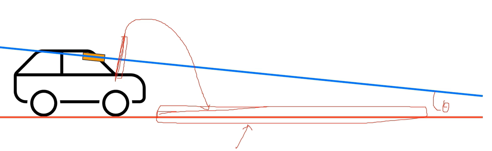

아래 그림으로 더 자세히 나타낸다. 이때 z값이 0인게 중요한 게 아니라 같은 값이기만 하면 됨. 정확히 하려면 카메라의 높이(H)여야 하고, 음수가 됨.

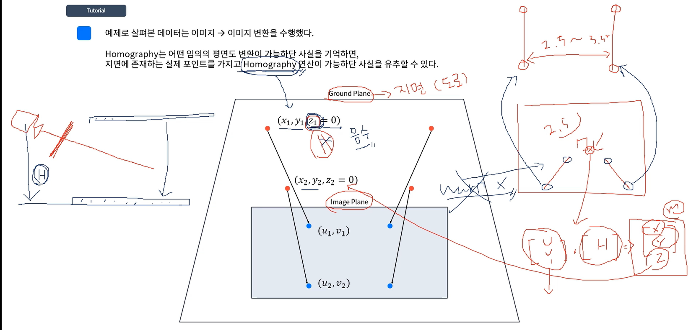

## 컴퓨터 비전에서 3차원 정보 복원 방식
1. 카메라의 extrinsic을 이용하는 방법
2. 카메라의 intrinsic과 대상 객체의 사전 정보를 이용하는 방법
3. 카메라의 image plaen과 대상 plane의 변환 mat를 사용하는 방법

이상이 컴퓨터 비전에서 다루는 '객체의 3차원 정보를 복원하는' 3가지 방법이다

카메라는 본직적으로 3차원 공간에 대한 정보를 이미지를 취득하는 과정에서 소실하므로, 3차원 공간에 대한 이해화 해석이 어려운 분야 중 하나이다.

- - -

# 추천

지금까지 학습한 내용은 monocular camera의 single image view를 활용한 3d vision(~reconstruction) 방법이다. 카메라를 1개만 사용하라는 법도, 1장의 이미지만 사용하라는 법도 없으므로, 추가적 공부를 하기 위해 아래의 책을 추천

* Multiple View Geometry in computer Vision (Richard Hartley and Andrew Zisserman) 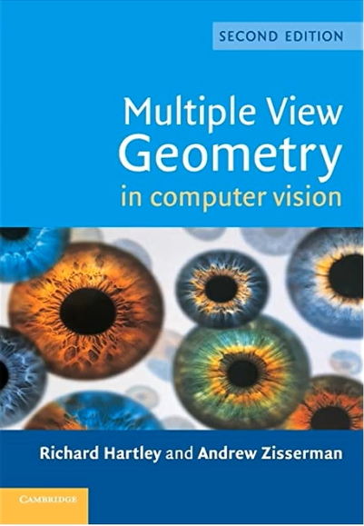

보다 저 자세하고 복잡한 내용을 다루고 있으며, 3d vision 분야에서 바이블로 통한다.

- - -

# Find Homography
`homography.py` 파일을 해석함

- - -

# Homography Distance Estimation 실습

cityscape 예시를 사용함. json 파일에 보면 extrinsic도 만들어두었음

